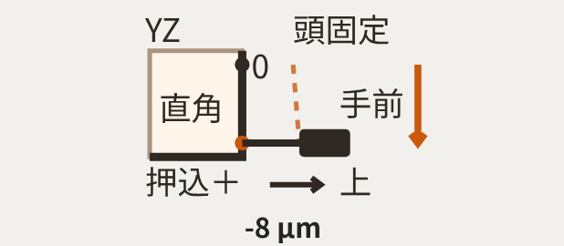
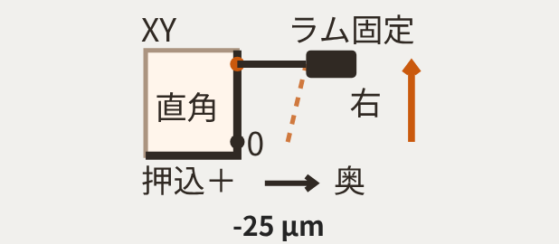

# 座標・測定配置・図の全面点検と修正案

点検対象は作業開始時の最新main **127b3ece7da64cab5d1fb9bbb998313d739fd905**。2026-10-07 UTC、GitHub branches/main APIと `git ls-remote … refs/heads/main` の両方で確認した。指定コミットへの巻戻しではない。本報告時点でアプリ・計算・保存形式・公開サイトは変更していない。新規ファイルは調査報告と再現資料のみ。

主担当が実装追跡と修正案を作成し、別の確認担当が独立幾何、部材運動、実Chromiumの証跡を検証した。過去の説明・成功テストは履歴として読み、物理的正しさの前提にはしなかった。

**結論：一括して図の左右や測定値の符号を反転する修正は適切でない。** 接触式は成立している。一方、全19面への旧図属性の混入、NCと部材位置の区別不足、旋盤の径内外説明の逆転、非一様支持下での横形パレット実移動と仮想測定経路の差を確認した。最後の問題は表示修正だけでは解消しない。ただし取付位置を決めずに測定計算を置き換えることもできない。

## 1. 八つの定義を分ける

|対象|現行の意味・点検結果|
|---|---|
|1 NC指令|NC指令値の独立状態・NC→部材変換はない。`positions`をNC座標と読む根拠はない。機種ごとのメーカー指令規約も未実装。|
|2 スライダー|`positions`は各可動部の中央を0とする正規化位置−100〜100。正は下表の**部材正方向**。mmでもNC指令でもない。|
|3 模型の移動|`axisConfig`、部材のaxes配列、`displayedModelPoint`等から決まる。理想状態の37部材群の正移動は軸設定と一致。非一様支持では部材の回転により部材内の点ごとに接線が変わる。|
|4 計器の相対移動|基準器搭載部が動くと符号が逆。現行有限測定ではXYは比較軸＋、XZ/YZは比較軸−。旋盤は主軸Zを基準、走査X−。|
|5 面・測定子・押込み|S面法線は始点基準軸＋、計器はその＋側、測定子の伸びは−側。押込みは測定子が本体へ戻る方向＋。**本体がSへ近づく方向は−側**であり、押込矢印と逆になる。|
|6 ゼロ後指示|スピンドル式通常カウントで伸びの減少を＋。`I=(λ始−λ終)×10⁶ µm`。＋Xとは別。|
|7 局所角度差|正の基準方向aと比較方向bから `q=−asin(a·b)×300000 µm`。90°より広いと＋。現在位置での換算値であり、300mm区間の指示差Iとは別。|
|8 画面の向き|模型はカメラ投影と表示誇張、新3枠は右=基準＋／上=走査軸＋の固定展開図。したがって全機種で図の右=機械右にはならない。Iだけから描く現図は姿勢を含む実経路の投影ではない。|

コード：[`app.js:12`](https://github.com/tgkfnfnfv9-stack/Training-tools/blob/127b3ece7da64cab5d1fb9bbb998313d739fd905/src/app.js#L12)、[`app.js:16`](https://github.com/tgkfnfnfv9-stack/Training-tools/blob/127b3ece7da64cab5d1fb9bbb998313d739fd905/src/app.js#L16)、[`app.js:550`](https://github.com/tgkfnfnfv9-stack/Training-tools/blob/127b3ece7da64cab5d1fb9bbb998313d739fd905/src/app.js#L550)、[`leveling.js:148`](https://github.com/tgkfnfnfv9-stack/Training-tools/blob/127b3ece7da64cab5d1fb9bbb998313d739fd905/src/leveling.js#L148)、[`reference-measurement.js:6`](https://github.com/tgkfnfnfv9-stack/Training-tools/blob/127b3ece7da64cab5d1fb9bbb998313d739fd905/src/reference-measurement.js#L6)、[`reference-measurement-ui.js:3`](https://github.com/tgkfnfnfv9-stack/Training-tools/blob/127b3ece7da64cab5d1fb9bbb998313d739fd905/src/reference-measurement-ui.js#L3)。

模型に重なる軸矢印は両端矢印（app.js:451–456）で、単独でNC＋を示してはいない。左の「向き目安」は名目部材軸をカメラ投影した単矢印（391–405）であり、支持変形・固有誤差を含む局所接線とは役割が違う。姿勢変化を伴う可動部の全頂点が一つの矢印と平行に動く、という検査基準も適切ではない。

|機種（支持数）|スライダー＋Xの部材／実方向|＋Y|＋Z|計器の相対運動との関係|
|---|---|---|---|---|
|小型立形（4）|テーブル／右|サドル・テーブル／奥|主軸頭／上|X/Yは逆、Zは同じ|
|横形（8）|コラム・主軸頭／右|主軸頭／上|パレット／奥|X/Yは同じ、Zは逆|
|移動コラム（6）|コラム・主軸頭／右|頭スライド／奥|主軸頭／上|全て同じ|
|固定門形（15）|テーブル／奥|主軸サドル／右|ラム／上|Xは逆、Y/Zは同じ|
|移動門形（8）|門全体／奥|主軸サドル／右|ラム／上|全て同じ|
|5軸（3、A=C=0）|トラニオン／右|サドル・トラニオン／奥|主軸頭／上|X/Yは逆、Zは同じ|
|旋盤（6）|刃物台／奥|対象外|往復台／右|刃物台計器はX/Zと同じ。主軸基準Zとは別|

この表は模型の部材座標でありNC符号表ではない。旋盤は現模型の工具が中心より手前にあり、＋X=奥は中心へ近づく。これを一般的なNC径増加の＋Xと同義にしてはならない。径／直径プログラミング倍率も現行にはない。

## 2. 全7機種・19面の対応表

以下は**現行仮想配置の読み解き**。実物の固定具・基準器寸法・干渉・到達性が保証された配置表ではない。Sは読みを比較する校正面、Rは方向合わせに使うSと直角な面。旋盤だけはRを設けず主軸に直角な精密フランジSを使う。表の「ゼロ」は仮想S面の位置であり、模型上の取付点は未定義。

投影欄は画面右・上に割り当てる物理方向を示す。現図は2D展開図で、実3D配置を見るカメラの視線や面法線に基づく正投影を計算していない。このため「全図を機械の正面から見た図」とは扱えない。

「＋→＋、−→−」等は**一定姿勢・配置誤差なし・純粋な局所角度差qの例**で、一般経路でqからIを作る符号表ではない。一般の正負は全行とも「押込み増加＋、減少−」。全行に共通問題A/Bがあり、これを「不一致なし」とは判定しない。

|機種／面|基準軸／走査軸|基準器搭載／計器固定|ゼロ接触位置|動く部材・実方向（部材符号）|計器の相対走査|接触側・測定子の伸び|押込み方向|q＋／q−のI|図の右／上|不一致・疑義|
|---|---|---|---|---|---|---|---|---|---|---|
|小型立形 XY|X／Y|テーブル／主軸頭|手前・右|サドル＋テーブル・手前（−Y）|奥|右から左|右|＋／−|右／奥|A B、P点限定|
|小型立形 XZ|X／Z|テーブル／主軸頭|上・右|主軸頭・下（−Z）|下|右から左|右|−／＋|右／上|A B|
|小型立形 YZ|Y／Z|テーブル／主軸頭|上・奥|主軸頭・下（−Z）|下|奥から手前|奥|−／＋|奥／上|A B|
|横形 XY|X／Y|パレット／主軸頭|下・右|主軸頭・上（＋Y）|上|右から左|右|＋／−|右／上|A B、奥へは走査不可|
|横形 XZ|X／Z|パレット／主軸頭|奥・右|パレット・奥（＋Z）|手前|右から左|右|−／＋|右／奥|A B **C**、下降不可|
|横形 YZ|Y／Z|パレット／主軸頭|奥・上|パレット・奥（＋Z）|手前|上から下|上|−／＋|上／奥|A B **C**、下降不可|
|移動コラム XY|X／Y|固定テーブル／主軸頭|手前・右|頭スライド・奥（＋Y）|奥|右から左|右|＋／−|右／奥|A B|
|移動コラム XZ|X／Z|固定テーブル／主軸頭|上・右|主軸頭・下（−Z）|下|右から左|右|−／＋|右／上|A B|
|移動コラム YZ|Y／Z|固定テーブル／主軸頭|上・奥|主軸頭・下（−Z）|下|奥から手前|奥|−／＋|奥／上|A B|
|固定門形 XY|X／Y|テーブル／ラム|左・奥|サドル・右（＋Y）|右|奥から手前|奥|＋／−|奥／右|A B、奥走査には軸交換が必要なのでしない|
|固定門形 XZ|X／Z|テーブル／ラム|上・奥|ラム・下（−Z）|下|奥から手前|奥|−／＋|奥／上|A B|
|固定門形 YZ|Y／Z|テーブル／ラム|上・右|ラム・下（−Z）|下|右から左|右|−／＋|右／上|A B|
|移動門形 XY|X／Y|固定テーブル／ラム|左・奥|サドル・右（＋Y）|右|奥から手前|奥|＋／−|奥／右|A B、奥走査へ交換しない|
|移動門形 XZ|X／Z|固定テーブル／ラム|上・奥|ラム・下（−Z）|下|奥から手前|奥|−／＋|奥／上|A B|
|移動門形 YZ|Y／Z|固定テーブル／ラム|上・右|ラム・下（−Z）|下|右から左|右|−／＋|右／上|A B|
|5軸 XY、A=C=0|X／Y|回転テーブル／主軸頭|手前・右|サドル＋トラニオン・手前（−Y）|奥|右から左|右|＋／−|右／奥|A B、旋回時は適用不可|
|5軸 XZ、A=C=0|X／Z|回転テーブル／主軸頭|上・右|主軸頭・下（−Z）|下|右から左|右|−／＋|右／上|A B、旋回時は適用不可|
|5軸 YZ、A=C=0|Y／Z|回転テーブル／主軸頭|上・奥|主軸頭・下（−Z）|下|奥から手前|奥|−／＋|奥／上|A B、旋回時は適用不可|
|旋盤 主軸基準XZ|**主軸中心線Z**／X|主軸の精密フランジ／刃物台|奥・右（仮想接触帯）|刃物台・手前（−X）|手前|右から左（主軸端面側）|右|−／＋|右／奥|A B **D**、下降不可、Z送り検査ではない|

- **A：表示不一致**。新図に旧局所図のゼロ位置・投影・符号属性が付く。コンパクト図にはR/Sの識別と展開方向の常時表示が不足。詳細本文には展開方向がある。
- **B：配置未確定**。模型上の基準器原点・計器固定点・ブラケット姿勢を指定せず、始点ごとにP=0、B=10mm×aを置く。図の経路はIから生成する圧縮模式線。部材軌跡そのものとは保証できない。
- **C：具体的な不一致を確認**。非一様支持下の横形Z送りではパレット上面の実模型軌跡と仮想面原点の積分経路が異なる。XZの具体値は次節。YZにも同じ経路の定義問題があり、同じ14.626µm差が出るという意味ではない。
- **D：旋盤の記録の誤り**。X−手前走査は、現模型の手前側工具では径外向き。以前の「外→内」と逆。フランジの絶対接触半径・300mmの径方向接触帯も未定義。

5軸の旋回姿勢（A≠0またはC≠0）は3面とも数値を抑止し「A/Cを0にして測定」。直線軸検査の配置を旋回後へ流用しない。別の既存4方向測定はA/Cを反映する。旋盤XY/YZおよびY軸検査は対象外、新設しない。

## 3. 確認できた一致と問題

### 一致している範囲

1. 立形の仮想図の接触ゼロと相対矢印は、XY=手前右→奥、XZ=上右→下、YZ=上奥→下。テーブルY移動と計器相対Y移動の反転も実装されている。
2. 横形・門形・旋盤の基準軸と走査軸は保持されている。上表の代替物理方向を採る限り存在しない下降送りを計算していない。
3. 線と面の交点式、固定面への接近＋／離反−、反対側接触、固定配置での逆走再ゼロ、共通剛体変換不変は独立式と一致。
4. 局所角度q、有限走査I、支持調整評価、既存4方向測定は別計算。今回これらを統合・変更していない。固有ガイド誤差も有限経路へ勝手に追加していない。
5. R/Sの直角を保証したマスタを必要とする説明があり、平定盤側面の直角を仮定していない。ただし図中でRとSを識別できない。
6. 300mm区間の始終交換は幾何を再計算し、積分距離と面内終点判定に走査方向が渡る。値だけに−1を掛けていない。
7. ソースからメモリ上でbuild.pyと同じ連結を行い、公開用index.htmlとバイト一致した。ビルド漏れはない。

### 問題・疑義と原因コード

|ID|判定・現象|原因コード|必要な範囲|
|---|---|---|---|
|A1|確定：新図と旧属性が矛盾。例：小型XYの可視0は手前右、`data-zero-location`は左手前。XZ可視0は上右、旧属性は左下。旧`positive-direction`も角度qの側でありダイヤル＋ではない。|accuracy-ui.js:195–206、272、278|表示/DOMのみ。旧属性を局所図に限定し、測定図は固有の意味を持つ属性へ。|
|A2|確定：新図は全機種同じ直角形状、終点接触はx=23固定、本体x=34−clamp(I/6)。計算された面姿勢・測定子方向・実接触点を描かない。|reference-measurement-ui.js:49–54|「押込みの模式図」と明確化するか、計算幾何を投影する描画へ。後者も計算式変更とは別。|
|A3|確定：R/Sの文字は通常マスタ図にない。黒い下辺と縦辺が同じclass。始点0は接触点にあるが、取付姿勢や実機の接触位置との対応を図から証明できない。|reference-measurement-ui.js:54、style.css:680–688|既存3枠内のR/S、ゼロ、実方向ラベル修正。大見出し追加不要。|
|A4|確定：スライダーは部材位置だが説明は単に「＋/−軸」。NC変換がない。|app.js:16–23、550–554、reference-measurement-ui.js:59|「部材−Y」「計器相対：奥」等の表示。NCとして動作変更するなら別仕様。|
|C1|確定：横形Zで有限経路と模型上面の軌跡が異なる。|reference-measurement-ui.js:33–42、accuracy-ui.js:95–118、app.jsのdisplayedModelPoint系|取付点と剛体運動を定義して共有する計算変更の候補。模型を直ちに誤りと断定しない。|
|D1|確定：旋盤の「外→内」説明が模型と逆。|app.js:23、286–287、docs/reference-zero-20261007.md、qa-reference-zero README|まず記録・説明訂正。X符号自体の変更やフランジ位置追加は計算/保存の検討が必要。|
|E1|仕様上の制限：区間は現在位置を中心にせず旧v1のlow/highを保持。負走査ではスライダー位置でゼロにならないことがある。|reference-measurement-ui.js:25–28|既存区間を維持し、始終の部材mm位置と「現在位置≠ゼロ」を明示。区間変更は測定仕様変更。|
|E2|仕様上の制限：毎回の局所接線への方向合わせと再ゼロ。有限のR面往復合わせ、保持ゼロ、方向合わせ誤差は再現しない。|reference-measurement-ui.js:31–40、59|現行モデルの意味を明記。有限合わせや誤差入力を加えるなら計算モデル変更。|
|E3|未保証：接触と面外は始点・終点のみで、途中の脱落は判定しない。一般経路には反例があるが現UI許容範囲での発生は未確認。|reference-measurement.js:13–16、reference-measurement-ui.js:43–46|全経路を保証すると表示しない。中間判定追加は有効/無効結果を変える計算変更。|
|E4|記録の過剰説明：5軸Yを支持格子境界がある経路のように説明しているが現機種は3点支持の一定平面。|app.js:9、supportList、leveling.js:95–98、docs/reference-scan-20261007.md|記録訂正。存在しない境界処理を追加する必要なし。|

### 横形の具体的反例

固有誤差なし、全軸中央、支持高さ（mm）を
`[.2,-.2,.06666666666666668,-.06666666666666668,-.06666666666666667,.06666666666666667,-.2,.2]`
とする。Z部材位置0→300mm、表示誇張なし。

- 現有限測定の基準面原点の移動：`[0,0,0.3] m`、XZのIはほぼ0µm。
- パレット上面中心raw `[0,1.27,-.85]` の模型移動：横方向 **−14.625959µm**、鉛直約0.000818µm、奥300mm。
- この上面点を基準面原点とし、同じ始点方向合わせ・法線輸送・線面交点で計算すると **−14.625959µm**。

支持基準からの高さ0.61mに対する姿勢変化が、模型上面には含まれ、現在の積分原点には含まれない。この反例は「正しい値が常に−14.625959」と決めるものではない。**どの固定点へマスタを載せたのか定義しないまま模型との一致を主張できない**ことを示す。

再現：[material-point-probe.cjs](qa-coordinate-audit-20261007/material-point-probe.cjs)／[数値記録](qa-coordinate-audit-20261007/material-point-probe.json)。

この最初の診断例は端数支持高を含み、通常の0.001mm刻み保存条件には合わない。そこで支持高を **`[.2,-.2,.067,-.067,-.067,.067,-.2,.2] mm`** に丸めて追加確認した。現有限値は依然ほぼ0µm、上面取付点での交点計算は **−14.612552µm** となり、通常の支持調整刻みでも差は消えなかった。固有誤差なしの診断条件であり、保存プロフィール全種類の互換試験とは別である。

再現：[0.001mm刻み版スクリプト](qa-coordinate-audit-20261007/material-point-quantized.cjs)／[数値記録](qa-coordinate-audit-20261007/material-point-quantized.json)／[実ブラウザー全画面](qa-coordinate-audit-20261007/browser/horizontal-material-quantized-main.png)／[XZの表示0µm](qa-coordinate-audit-20261007/browser/horizontal-material-quantized-XZ-live.png)／[撮影状態](qa-coordinate-audit-20261007/browser/quantized-state.json)。画像に代替計算値を重ね書きしていない。

### 実ブラウザー画像とコードの対応

公開HTMLをHTTPS取得しmainとバイト一致を確認した後、ローカル応答へそのHTMLを供給して実Chromiumで描画した。直接の公開URLブラウザー遷移とは区別する。画像の図・数字を編集していない。

|画像|画像で分かること／コード|
|---|---|
|[小型立形・全画面](qa-coordinate-audit-20261007/browser/compact-main.png)|UIと3枠・模型・水準器の現在状態。模型に基準器/計器の実固定点は存在しない。|
|[小型XZ](qa-coordinate-audit-20261007/browser/compact-XZ-live.png)|0は上右。DOMには旧「左下」も残る。見えない属性は画像だけでなくobservations.jsonの記録で確認。accuracy-ui.js:272,278。|
|[横形YZ](qa-coordinate-audit-20261007/browser/horizontal-YZ-live.png)|画面右の矢印が「上」、画面下への走査が「手前」。展開図としては整合するが、小図に投影の凡例がない。reference-measurement-ui.js:54,60。|
|[固定門形XY](qa-coordinate-audit-20261007/browser/double-XY-live.png)|画面上への相対矢印が「右」、押込が「奥」。R/Sのラベルがない。reference-measurement-ui.js:54。|
|[旋盤・全画面](qa-coordinate-audit-20261007/browser/lathe-main.png)|手前側刃物台と主軸の位置関係。app.js:286–287。|
|[5軸旋回時](qa-coordinate-audit-20261007/browser/five-A20-suppressed.png)|A=20スライダー単位（9°）で3面の値を抑止。reference-measurement-ui.js:23。|





上の2枚は「方向の文字が物理的に間違い」という証拠ではない。図の上下左右と機械の上下左右が違うこと、R/S識別が不足することを示す。全19面の画像は同ディレクトリの `*-live.png` にある。

## 4. 修正前後の図案（未実装）

### 共通の展開図

```text
現行：                              提案（同じ3枠の中）：
  XY     頭固定                      XY   奥↑ / 右→   頭固定
 ┌───┐      ▣                       ┌────S●──[計器]
 │直角│    /   奥↑                  │     │   ↑ 相対 奥
 └──●0   /                          R─────●0  手前・右
 押込＋ → 右                         伸び←  押込→右

旧data-zero-location=左手前          data-measurement-zero=手前・右
旧投影・旧角度符号が混在              局所qの属性は別の局所表示にだけ残す
```

```text
立形XZ（正面の物理方向）        立形YZ（側面の物理方向）
        上                           上
    S ●0──[計器]  右側          S ●0──[計器]  奥側
      │     ↓相対下               │     ↓相対下
    R └────→右                  R └────→奥
    測定子← / 押込み→右           測定子←手前 / 押込み→奥
```

ここで押込み矢印は測定子の収縮方向である。本体が固定面へ近づく矢印として描かない。R面の方向合わせには別の接触位置・工程が必要で、S上の●0は方向合わせゼロではない。

### 機種の違いを隠さない

```text
                   展開図の右     展開図の上    ●0 → 相対走査
立形 XY            機械右         機械奥        手前右 → 奥
横形 XY            機械右         機械上        下右   → 上
門形 XY            機械奥         機械右        左奥   → 右
横形 XZ            機械右         機械奥        奥右   → 手前
横形 YZ            機械上         機械奥        奥上   → 手前
旋盤 主軸基準XZ     機械右         機械奥        奥右   → 手前
```

立形の「奥へ」「下へ」を一律に貼らない。基準/走査軸を交換して外見だけ揃えない。門形XZ=図右は奥、門形YZ=図右は右である。

```text
旋盤（上から見た現模型）
     奥
     ↑  部材＋X：中心へ
主軸 ●────────────→ 主軸Z（右）
        工具（手前側）
     ↓  部材−X：手前へ／径外側へ
     手前

修正前の記録：−X 手前 = 外→内
修正案の記録：−X 手前 = 現模型の手前側工具では内→外
              （絶対のゼロ半径とフランジ実装位置は未定義）
```

## 5. 計算変更案と保存互換性

### 表示だけで修正できる項目

旧DOM属性の分離、部材符号と相対走査の明記、図中R/Sと機種別方向の識別、旋盤の径内外説明訂正、有限値と局所値の説明整理。数値I/q、既存区間、保存JSON、模型移動は維持できる。既存UIの色・大きさ・配置を基礎に行い、大きな「XY 基準X」、丸いダイヤル、1周操作は追加しない。

### 承認前に採用しない計算案

横形の不一致を解消する有力案は、**固定具の取付点を部材の局所座標で定義し、模型と測定に同じ非誇張の剛体変換を使う**こと。現行の「代表接触点の局所方向を積分する」仮定からの変更であり、単なる描画バグ修正とは扱わない。

部材の姿勢をR、原点をt、局所取付点をp/b、面法線と測定子方向をn₀/u₀として、

```text
P(s) = t_master(s) + R_master(s) p
n(s) = R_master(s) n₀
B(s) = t_body(s) + R_body(s) b
u(s) = R_body(s) u₀
λ(s) = n(s)·[P(s)−B(s)] / [n(s)·u(s)]
I(s) = [λ(s₀)−λ(s)] × 10⁶ µm
```

PやBの微分には `t′+R′p` が入る。局所軸方向の積分だけでは一般に `R′p` が決まらず、高さ/腕長の影響を再現できない。小型XYは既存Pの有限差分を使っており、同じ姿勢効果を二重加算しない。門形の構造写像は非直交なせん断を含むため、部材の変形写像をそのまま剛体固定具の回転Rとして使わない。

もう一つの選択は現行の抽象的な代表点を維持し、実模型の特定位置に装着した測定とは区別すること。この場合は有限値を変更しないが、ユーザーの求める模型と測定配置の一致を完全には達成しない。したがって推奨は取付位置を明示する案だが、位置・高さ・姿勢の採用は本点検では未承認。

接触式そのものを変更する根拠は見つかっていない。全経路の接触保証を必要とするなら中間接触/面内/測定子範囲の判定も必要となり、有効値を抑止する条件が変わる。

### 手計算で区別すべき例

```text
固定面 x=0、右側本体 x=10mm、測定子 u=−x
  本体 10.000→ 9.990mm：I=+10µm（近づく）
  本体 10.000→10.010mm：I=−10µm（離れる）
左側へ当て替え、同じ+x移動：I=+10µm（今度は近づく）

一定姿勢、a·b=−sinδ、L=0.3m、相対走査符号r
  I=10⁶ r L sinδ、q=300000δ
  q=+10µm：r=+1なら約+10µm、r=−1なら約−10µm
  一般の回転・曲線経路にはこの対応を流用しない。

同じ固定配置を維持して逆走し、新始点で指示だけゼロ：
  I逆=(λ終−λ始)=-I順（途中姿勢が変わっても成り立つ）
基準器を新始点で方向合わせし直す現モデル：
  新始点で面・計器を再設定するため、一般には上記の逆走とは別。
  一定姿勢では同じ方向になり、符号反転と一致する場合もある。
```

基準面の方向合わせ誤差も機械誤差とは別。独立例で機械経路の傾き20µradは−6µm、基準面の傾き50µradは＋15µm、両方なら＋9µm。同じ一つの読みから両者を分離推定できない。現行は方向合わせ誤差ゼロを仮定し、入力や独立測定は持たない。

### 保存の意味

`leveling-ui.js:27`の保存対象は機種・個体・支持・寸法・軸位置・表示設定等で、reference-scanの保持ゼロ、固定具原点/姿勢、測定結果Iは保存していない。

- 表示のみの修正なら旧JSONの意味・再計算結果は維持できる。
- 固定取付点による有限モデルに変更する場合、旧JSONは同じ機械状態として読めても、**同じ表示測定値を再現する保証はなくなる**。機械計算IDと測定仕様IDを分け、変更説明を明示する必要がある。
- 手動取付点・方向合わせ誤差・保持ゼロを保存するなら測定状態の別versionと移行方針が必要。旧JSONに存在しないゼロ履歴を捏造しない。
- 旋盤の既存positionsを反転したりNC指令値へ置き換える場合は、旧axisPositionsの意味にも影響する。別層でNC→部材変換を追加し、既存positionsを部材座標のまま保つだけなら保存の意味を変える必然性はない。説明訂正と軸反転を混ぜず、保存互換性を別設計する。
- 局所角度、支持調整評価、固有誤差がレベル調整だけでは消えない教材モデルは維持対象。

## 6. 過去の変更の意味

|変更|表していたもの|今回の判断|
|---|---|---|
|22f2b24 現在線だけ鏡映|局所角度qは不変、見えるオレンジ線/先端/矢印だけ左右反転|実軸幾何や接触式の変更ではない。測定配置の証明には使えない。|
|6a5b1af 鏡映撤去|正軸間角の広がり/狭まりに旧局所図を合わせ、門形主軸の見かけも調整|局所qの表示整合を改善した段階。有限測定の意味はまだない。|
|4faa776 有限測定化|主表示をqから接触ゼロ後300mmのIへ変更。再方向合わせ・仮想固定具・代表経路を導入|測定仕様/計算の追加。局所qや保存機械モデルは残る。|
|127b3ec ゼロ位置変更|同じlow/high区間で始終を交換しreference-scan-v2へ。新始点で再方向合わせ/再ゼロ|図だけでも単純な符号反転でもない。ただし配置を維持した逆走とは区別が必要。|

## 7. 別枠の4方向測定

対象は小型立形・移動コラム・固定門形・移動門形・5軸の5機種。右・奥・左・手前、手前0、他3点は手前差、手前が面外なら全数値抑止という要件はコード上維持されている。横形/旋盤へ追加しない。

平面 `高さ=ax+bz`、上向き主軸、半径Rの独立計算では右/奥/左/手前の手前差は `R(a+b), 2Rb, R(−a+b), 0`。R=0.15m、a=100µrad、b=200µradなら **45,60,15,0µm**、符号反転で **−45,−60,−15,0µm**。実装と一致した。詳細は運動担当の別報告を参照。

Z送り軸と主軸回転中心線を同一と仮定しない。立形群は現教材では代表主軸を固有Zから作るが、これはモデルの仮定。横形ではZはパレット送り、旋盤では往復台Zと主軸Zが別経路にある。5軸の4方向測定は旋回テーブル面へ当てる既存計算で、直線軸3面の旋回姿勢検査の代用ではない。

## 8. 検証証跡・未確認事項

資料は [qa-coordinate-audit-20261007](qa-coordinate-audit-20261007/) に保存。再現スクリプトはリポジトリルートで実行する。アプリに監査fixtureを追加していない。

|今回の検証|結果と限界|
|---|---|
|新規独立幾何|数値比較130件成功。理想、既知正負角、近接/離反、反対側、姿勢変化を伴う固定配置逆走、共通剛体移動、方向合わせ誤差、解析曲線、区分積分。アプリ側の理想は全19面×両端/中央。|
|部材運動|独立に期待方向を定義した理想37可動グループで一致。横形の非一様支持では前述の14.626µm差を検出。|
|4方向の独立平面例|理想0、45/60/15/0µmとその逆符号を確認。5機種の面外抑止のコード確認と既存152検査の再実行を別記。|
|新規Chromium|全7機種・19面、30状態検査成功、JS例外なし。カメラ/ズーム/誇張不変、支持往復、実JSONダウンロード→ファイル入力読込、直線軸両端、5軸姿勢抑止。|
|支持境界|新規独立の区分解析積分を確認。既存check-measurement-referenceの横形格子横断・独立中点積分も再実行。全支持値/全経路の連続接触を保証するものではない。|
|既存回帰5本|reference-zero、measurement-reference、full-sign-geometry、multi-spindle-sweep、adjustment-flowの5本成功。過去の前提を含むため、これだけで配置妥当性とは判定しない。|
|ビルド/公開|srcからの連結がindex.htmlと一致。HTTPS取得した公開HTMLも同じSHA。新規公開はしていない。|

独立幾何130件に含む保存確認はJSON往復・内部再適用。実ファイルの保存/読込は別のChromium検査で確認した。携帯サイズや実機タッチの追加試験は今回未実施。

- [対象ファイルのSHAとビルド一致](qa-coordinate-audit-20261007/source-integrity.json)
- [独立幾何スクリプト](qa-coordinate-audit-20261007/independent-geometry.cjs)／[結果](qa-coordinate-audit-20261007/independent-geometry-results.json)
- [部材運動・4方向の独立確認](qa-coordinate-audit-20261007/kinematics-audit.md)
- [ブラウザー画像と確認範囲](qa-coordinate-audit-20261007/browser/README.md)
- [既存テストの再実行](qa-coordinate-audit-20261007/existing-regression.json)（物理配置の証明とは別）

未確認：実機の固定具取付可否、校正面の実寸・精度、衝突、計器の実ストローク/測定力、全位置連続経路の接触保証、機種固有のNC制御規約、実スマートフォンの指操作。横形以外の全取付点での非一様姿勢に対する軌跡一致は証明していない。これらをテスト成功から補完しない。

本報告は修正案まで。表示修正と測定モデル変更を分けてレビュー可能にした。特に取付点の導入、区間の選び直し、保持ゼロ、有限方向合わせ、NC符号への変更は、本点検依頼を承認として実装しない。
