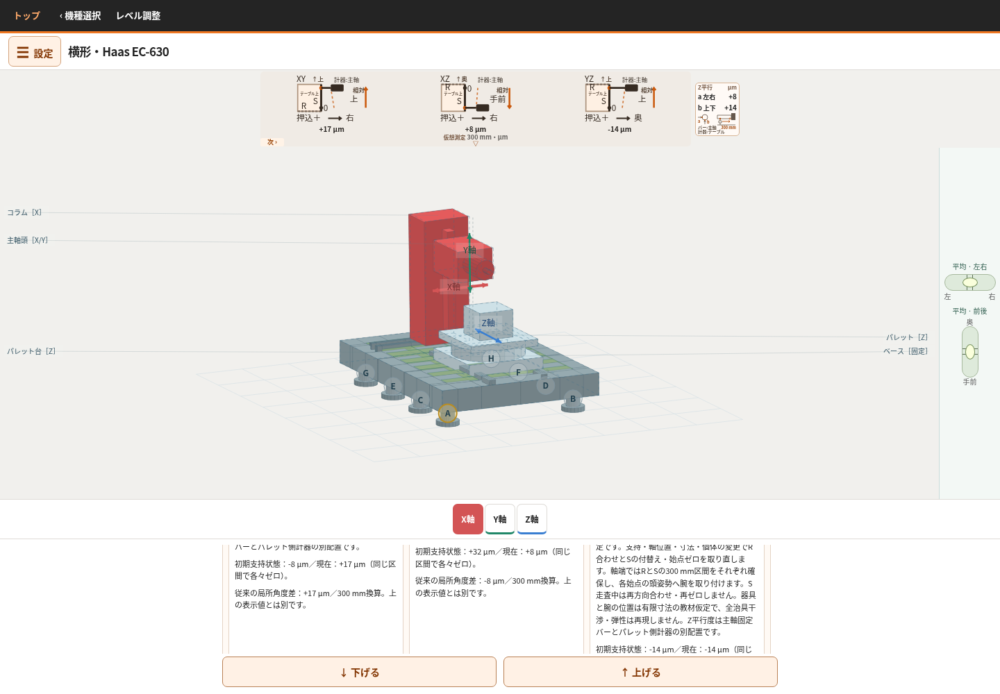
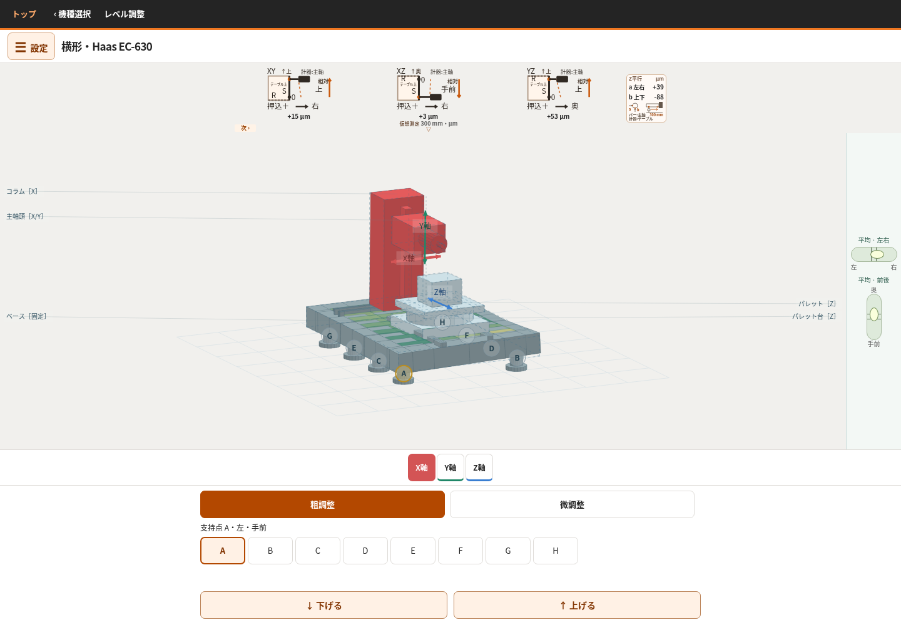

# 横形だけの再監査：測り方・動く部材と現在の表示

2026-10-10。ユーザーの最新指示「一回横マシだけ、とりあえず測定方法、どこか動くかを確認。今のものと比べる」に範囲を限定した。**今回は製品コード・測定方式・数式・符号を変更していない。** 前回PRを測定配置全体の解決済みとは扱わず、物理の方法、実装の追跡、実ブラウザーを別担当に分けて調べ直した。

最新mainを再fetchし `cbdcf81a4b3b252d4113621b8361b20640955688` を確認。PR #32は未マージ、監査した修正版は `5d95690c5875efe53268d319efcac62dce22cce8`。公開HTMLのSHA256は `7c63eaa1c49ab749e7e898f228a6c88151185c0a5ca68566fda46e8c731c03d9`、PR版は `a33e7a9efc3094f41d51bbf48ca541176d8e9984aa3774a5d5ff3ec54edfbf7c`。閲覧版の回答がないため、両方を同じ入力で確認した。

## 部材の動き

|操作|実際に動くもの|固定されるもの|
|---|---|---|
|X|コラム・主軸頭・主軸に付けた器具|テーブル・パレット|
|Y|主軸頭・主軸に付けた器具|コラム・テーブル・パレット|
|Z|テーブル・パレット・その上の器具|コラム・主軸頭・主軸固定バー|

ここでいう＋はアプリの部材方向。実機NCの＋指令と同じとは認定していない。

## 現在PRの測り方

|検査|基準器|ダイヤル取付先|本測定で動く部材|接触側|
|---|---|---|---|---|
|XY|テーブル上の直角マスタ|主軸側|主軸頭をY＋へ|マスタ右側から左向き|
|XZ|テーブル上の直角マスタ|主軸側|テーブルをZ＋へ|マスタ右側から左向き|
|YZ|テーブル上の直角マスタ|主軸側|主軸頭をY＋へ|マスタの主軸側から手前向き|
|バーa|主軸固定バー|テーブル側|テーブルをZ＋へ|バー左9時から右向き|
|バーb|主軸固定バー|テーブル側|テーブルをZ＋へ|バー下6時から上向き|

XY/XZのR合わせは主軸側計器をXへ送る。PRのYZはR上面に主軸側計器を止め、テーブルZ送りでRを合わせ、選択Zへ戻してから縦面SをYで測る。全項目は始点ゼロから300 mmの指示差。主軸は回さない。支持や軸位置を変えた後は再取付け・方向合わせ・ゼロをやり直す。

[配置図と正負の物理的根拠](method.md)には、Rの接触側、Sの接触側、始点と終点を分けて記載した。押込み＋を、角度＋やNC＋へ一括で読み替えてはいけない。

## 現在の何が問題か

### 1. 前回、取付先の指定だけからYZの測定方法まで変えた

ユーザー指定の「テーブル上のマスタ・主軸側ダイヤル」は、公開版の上面測定とPR版の縦面測定の両方で成立する。これだけでは接触面・R合わせ・送りは一意に決まらない。それにもかかわらず前回の統括判断で方式を変更した。

|YZ|公開版|PR版|
|---|---|---|
|R合わせ|Yの代表案内方向へ仮想合わせ（実送り合わせは未実装）|テーブルZ送り|
|本測定の面|上面|主軸側の縦面|
|本測定の送り|テーブルZ|主軸頭Y|
|測定子|上から下|奥から手前|
|used123456・平坦・中央の生値|＋14.120 µm|−14.120 µm|

同じ測定の表示修正ではなく、測定方法の変更だった。一定姿勢・直線送りという単純条件で、旧方式と新方式の指示が逆になることを実装外の接触幾何でも導いた。ただし長腕・ねじれを含む全条件で単純に−1倍する関係ではない。**一律に符号を戻すのも、現PRの方式を唯一の正解とするのも根拠がない。**

### 2. 同じXZ説明内に、＋8と−8が並ぶ

used123456・平坦・中央で上段の接触指示は＋8.129 µm（整数＋8）、詳細末尾の局所角度換算は−8.129 µm（整数−8）。別定義との注意はあるが、同じXZの説明内に並ぶ。利用者が「数値が逆」と読む具体的な画面を再現した。

これは丸め差ではない。押込みを正とする量と、90°より大きい角度を正とする量を混ぜて表示している。局所角度値をダイヤル測定の説明に載せる必要性と、正負の説明を見直す対象であり、数式反転の根拠にはしない。

### 3. 模型の現在位置と、数値の測定区間が違う

Yを中央から上端へ動かすと模型の鼻端は300 mm上がるが、XY/YZの測定区間はY=0→300 mmのままになる。現在位置から300 mmを確保できないため、測定の始点を戻している。同様にZ=50→100ではXZ/a/bの区間が固定される。

実ブラウザーで現在位置とDOM更新が一致することも確認し、この例を更新停止とは判定しなかった。しかし上段だけでは、「今そこにある計器の指示」と「別区間で取付け直して測った結果」を区別しにくい。動作デモも計器の実走査ではなく、部材の往復である。[追跡と数値](trace.md)。

### 4. 短い計器腕で測る配置になっていない

標準寸法・理想・平坦で、現在模型の主軸鼻端の最低高さは2250 mm、テーブル上マスタの測定範囲の最高は1630 mm。同じ物理原点で**620 mm離れている**。Y送りだけで鼻端高さの計器をマスタへ近づけることができない。

さらに300 mm全区間を測るには最低約920 mm、中央の測定では約1220 mmの下向き取付けが必要。バー用計器も中央でテーブルから約1.28 mの立上げを仮定している。現在の数式にはその腕の剛体運動が入るが、3D模型には腕・計器・マスタが描かれず、サンプルワークが残る。

この状態で「普通にテーブル上のマスタへ主軸側ダイヤルを当てた測定を再現した」と報告するのは不十分だった。長腕での理想接触計算が一致しても、その仮定の妥当性は別問題である。[別計算と実座標の高さ照合](fixture-heights.md)を残した。実機での剛性、全機械との干渉、µm級測定の成立は未認定。

## 担当と確認できた範囲

|担当|実施したこと|結果|
|---|---|---|
|fresh_horizontal_method|コード未読で測定法・接触符号を導出後、現行と照合|[測定法](method.md)、[寸法・腕](fixture-heights.md)|
|fresh_horizontal_trace|支持→姿勢→R/S→接触→raw→整数→各表示を追跡|[95状態とデモ9記録](trace.md)|
|fresh_horizontal_review|公開版とPRを実Chromiumで操作・撮影|[ブラウザー報告](horizontal/horizontal.md)|
|統括|方式変更と取付寸法の前提を再評価、結果の食い違いを照合|この文書。製品修正を完了扱いにしない|

この監査で、rawを整数にする途中の符号反転や、デモ中の古いstate参照は再現しなかった。それを根拠に、測定配置全体を正しいとはしていない。

次の修正判断は、(1) 模型の寸法と成立する測定取付け、(2) YZで採用する面・送り、(3) 画面の現在位置と測定区間、(4) 接触指示と局所角度の表示、を先に固定する必要がある。別の配置を黙って採用してから、その配置だけに合う期待値を作る進め方を繰り返さない。

原依頼の不整合修正は継続課題。現在のPRはドラフトのままであり、今回の監査を修正完了の宣言に置き換えない。[PR #32](https://github.com/tgkfnfnfv9-stack/Training-tools/pull/32)。
