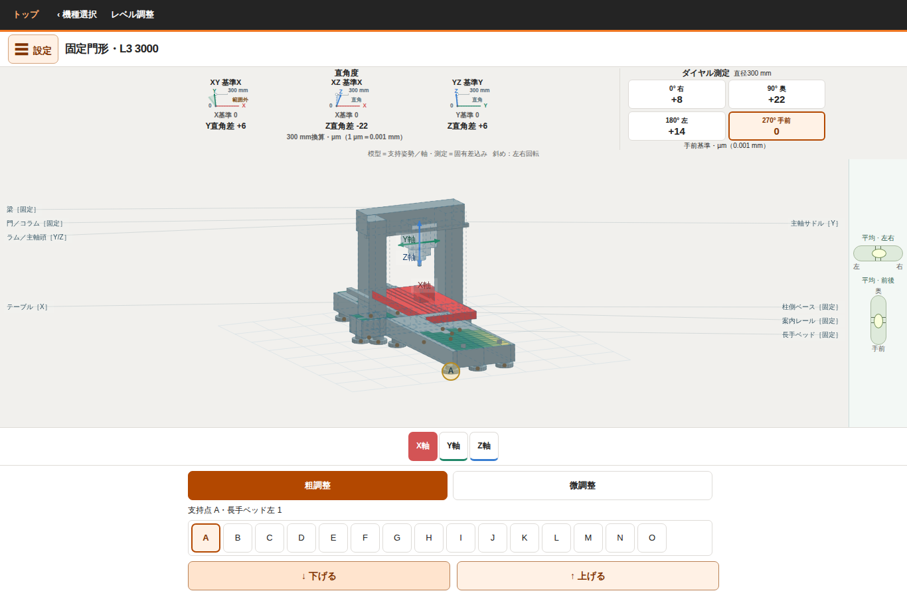
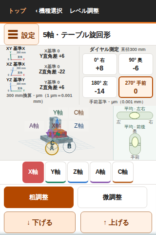

# 手前基準への変更と検証（2026-10-06）

対象は小型立形・移動コラム・固定門形・移動門形・5軸の5機種。横形・旋盤は対象外です。

## 変更

- 角度と方向は0°右・90°奥・180°左・270°手前のままです。
- 読みを `h(θ) − h(270°)` に変更し、手前は厳密に0とします。
- 手前が面外なら全点の読みを抑止します。右だけが面外なら他の面内点は表示します。
- 表示・説明・初期選択を手前基準に統一しました。
- 接触点、直角度、支持モデル、保存形式は変更しません。旧保存からも同じ機械状態を復元し、手前基準の読みを再計算します。
- 理想平面の教材モデルであり、上面の凹凸・主軸回転振れ・接触荷重は再現しません。

## 自動検証

独立確認担当が全37本を再実行し、すべて成功しました。測定単体323項目、5機種の独立幾何検証147項目、調整操作153項目を含みます。実行前後でソースと生成HTMLのハッシュが変わっていないことを確認しました。

[自動検証結果](automated-results.json)

## 実ブラウザー検証

- 検証候補：`1270276f5b471c5ab506b53e8d28f280b6583be9`
- GitHub Actions：[実行結果](https://github.com/tgkfnfnfv9-stack/Training-tools/actions/runs/37427442280)
- Chromium：小型立形100項目＋5機種650項目＝750項目、失敗0、ブラウザーエラー0。
- PC 1366×900、携帯縦320×480／320×568／390×844、横568×320／844×390。
- 支持調整・復元、保存読込、4点選択、軸移動、面外判定、表示操作による値の不変性、基準の説明と文字の収まりを確認。
- スマートフォン実機での指操作は未確認です。
- 検証した生成HTMLのSHA-256：`83a3c2ee710c598dfa50950a9809b1317604ec32df5c1f3a0a8b676b5a3c361c`

## 実ブラウザー画面

