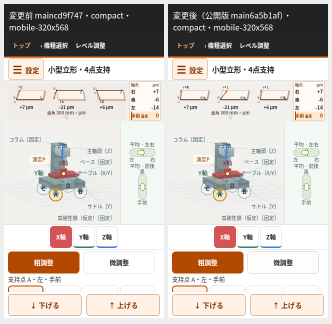
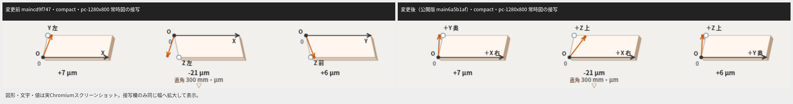

# 全7機種の模型・座標・符号の独立監査

比較の変更前は main `cd9f747b81fbe1dd9f530b1c8c925a519f99deb8` の実画面を使った。アプリ変更コミットは `6a5b1af0b105c593a23397aed64fb36faaed2836`、最終HTML SHA256は `e6bf5d4557199dde6be5efc93f5c3470d38f9ace440359e11aac2a19b02588f7`。公開URLは https://tgkfnfnfv9-stack.github.io/Training-tools/ 。公開成功を確認した。Pages実行37546244862はsuccess、クエリーなし公開URLの独立curl取得はHTTP200・TLS検証0で、最終HTMLとバイト一致した。根拠は [publication.json](publication.json) に記録した。

独立監査で、計算の「＋＝正軸間の角度が直角より広い」に対し、常時図だけ現在線を鏡映していたことを確認した。純粋な＋10µmの例では実正軸間角は90.00190986°、投影前の模式座標では、誇張角99.549°が変更前の常時現在線で80.451°へ鏡映されていた（実SVG画面の角度は投影で異なる）。正軸の比較として図と意味を揃えるため鏡映を外し、全19面のO・0を左下、基準を右、比較正軸を上へ統一した。＋は理想より基準の逆側へ離れて広がり、−は基準側へ寄って狭くなる。各端に「＋X 右」「＋Z 上」等の機種別物理方向を添えた。投影・誇張は表示専用で、数値へ使わない。

図のO・0は共通の比較始点、軸操作の0は中央、ダイヤルの手前0はその測定の基準であり別である。縦向き主軸の5機種は＋Zが上、下降は−Z。純XZ＋10µmでは上向き＋Zの上端が左へ傾くため、下降−Zは右へ進む。下降で比較正軸の角度値の符号は反転しない。横形のZは奥へのパレット送り、旋盤のZは水平送りである。旋盤の直角図は「主軸Z 右」を基準とし、往復台のNC送りZとは区別する。機種別の物理基準・測定方向・符号は [前仕様](../measurement-reference-20261006.md) を維持した。

門形2機種は、従来支持姿勢だけで描いていたラム・主軸を、測定で使う固有差込みの代表Z方向へ表示上だけ回転した。noseは動かさず、柱・梁・ベッド・支持・ワーク・軸送りは維持した。門形詳細も、主軸方向の値と左右柱の支持倒れを区別する説明にした。固有誤差・直角値・ダイヤル押込み＋・300mm局所角換算・保存形式は変えていない。

修正担当とは別に、計算監査・模型監査・UI監査を分担した。支持A±0.01mm、純粋な固有直角差±10µm、支持曲率、人工的な純曲率面、軸0/50/100およびZ0→−50→−100→0を使った。人工曲率面は監査fixtureで、機能や保存データへの追加ではない。ガイド曲がり値は既存の固定成分で、単独変更が模型や直角値を変えないことも確認した。

|検証|結果・根拠|
|---|---|
|全自動検証|旧38本＋新独立幾何1本、全39本成功・失敗0。最終e6bf版の直接nodeのstdout/exitcodeを記録した|
|独立幾何|6803チェック、636状態/1824角度/1185可動群、ダイヤル1980接触点。角度の300mm値を内積から復元し最大差6.67×10⁻¹¹µm、押込み差は最大5.30×10⁻¹⁰µm|
|小型P・Z復元|実P送り差分42例の単位方向最大差2.83×10⁻¹²。Z下降/復元49例の状態・値・基準頂点完全復元|
|門形の実円柱|[独立4494チェック](PORTAL-AUDIT.md)。実端リングから方向を復元、nose固定、部材剛体寸法と非Z骨格を保持|
|実Canvasの模型内包|756フレーム。全7機種×6サイズ×固有/支持正負×XYZ両端/中央×誇張有無、実fill頂点に切れなし|
|実ブラウザー配置・符号|公開版でも3794チェック、114開閉/選択表示＋513符号表示、失敗0。全19面×PC/320/短横で±900/±30/±0.5/±0.49/0を確認。0表示は理想に重なり、±0.5から±1µmを表示|
|寸法・回帰・ダイヤル|公開版の寸法385、調整/保存/読込/視点/ズーム/設定929は失敗0。固定描画coreの5機種ダイヤル650も失敗0。手前面外は全値抑止、他3点は手前差|
|数値互換|全7機種で数値・raw図属性・詳細SVG・保存状態完全一致。数学/保存10関数は全文SHA一致、1関数は既知の説明コメント1行だけ相違し式全文は一致|
|独立UI・操作|公開版でも668配置/符号＋123操作、失敗0。キーボード・44px操作・選択focus、支持復元・実download/upload/reloadを確認|
|タッチ|Chromium CDPで4サイズのドラッグ・ピンチ・ダブルタップ抑止、測定不変を確認。スマートフォン実機の指操作は未実施|

門形4494・Canvas756・650ダイヤル・タッチ4は描画core `7f5ebba7` で実施した。最終 `e6bf5d45` は門形説明の3箇所だけ異なり、既知の3置換を逆にするとcoreのHTMLと完全一致することを [source-compatibility.json](source-compatibility.json) で確認した。最終39本・独立幾何6803・数値互換7機種は最終e6版で直接実行し、公開ブラウザーの3794/385/929と独立UI668/操作123も最終e6版で再実行した。ブラウザーJS例外は0。

初回Node内spawnSync経由の記録にはEPERMと空のstdoutが残ったため、最終全39本は直接shell/node経由で出力と終了コードを保存し直した。別の直接実行で見つけた旧中心期待は、実描画helperの部材中心へテストを追従させた。方向の独立式と許容差は維持した。既存ダイヤル検証のno-op初期化fixtureも実個体を直接設定する形へ強化し、代表主軸の代用を実描画端点に替えた。

図形寸法・3図横並び・小さい「直角」「触れ」・水準器・模型・操作欄の配置は維持した。同じviewportでは7機種の全19面が同寸法。水準器は長短辺を入れ替えた一致寸法を保持する。

|ブラウザーサイズ|実板幅×高さ（px）|変更前比|
|---|---:|---:|
|PC1280×800|109.64×34.89|1.00|
|携帯390×844|60.59×19.28|1.00|
|320×568|56.26×17.90|1.00|
|320×480|54.82×17.44|1.00|
|横844×390／568×320|66.36×21.11|1.00|

ブラウザー描画はTLS検証済みcurlのHTMLを実公開originのChromiumナビゲーションに供給して行った。Chromiumによる直接TLS取得とは区別し、証明書設定やTLS検証は変更していない。携帯サイズの実ブラウザー検証であり、スマートフォン実機の指操作確認は未実施。

次の比較画面は左が変更前、右が公開版で、同じ個体seed78129・支持/軸状態を使う。接写も実Chromium画面を並べたもので、図・数値を編集していない。公開版の全機種・6サイズと正負表示を再検証してから撮影した。

|比較|全体|常時図の接写|
|---|---|---|
|PC|[画面](comparison--compact--pc-1280x800.png)|[接写](comparison-closeup--compact--pc-1280x800.png)|
|携帯縦|[画面](comparison--compact--mobile-390x844.png)|[接写](comparison-closeup--compact--mobile-390x844.png)|
|320px幅|[画面](comparison--compact--mobile-320x568.png)|[接写](comparison-closeup--compact--mobile-320x568.png)|
|携帯横|[画面](comparison--compact--landscape-844x390.png)|[接写](comparison-closeup--compact--landscape-844x390.png)|

門形主軸の姿勢も同じ状態で比較した：[PC](comparison--double--pc-1280x800.png) ／ [320px幅](comparison--double--mobile-320x568.png)。

再実行はリポジトリのルートで `node tests/check-full-sign-geometry.cjs`、`node tests/browser-full-sign-layout.cjs`、[門形監査の3コマンド](PORTAL-AUDIT.md)、`node docs/qa-full-sign-audit-20261006/model-bounds.cjs` を実行する。全機種のraw記録と全画面は実行時のtmpにも保存している。
