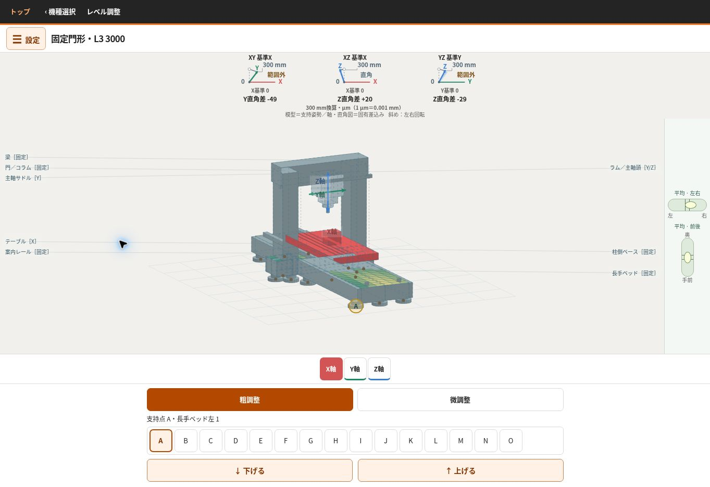
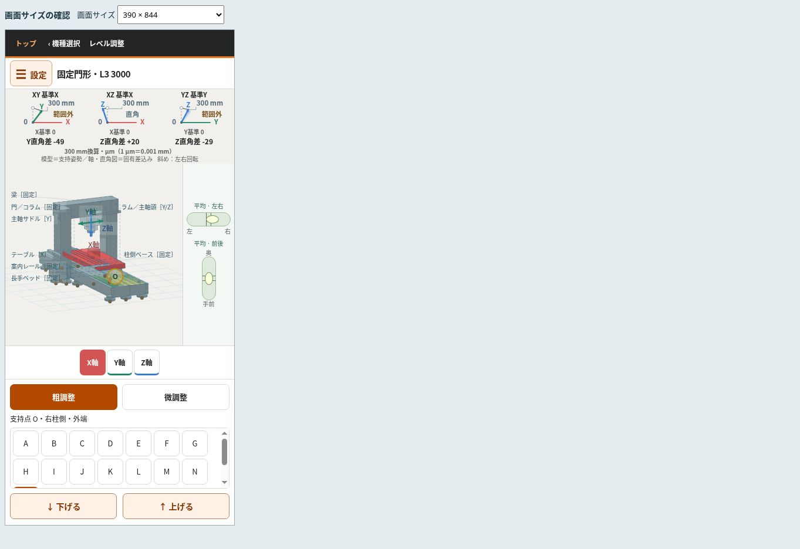
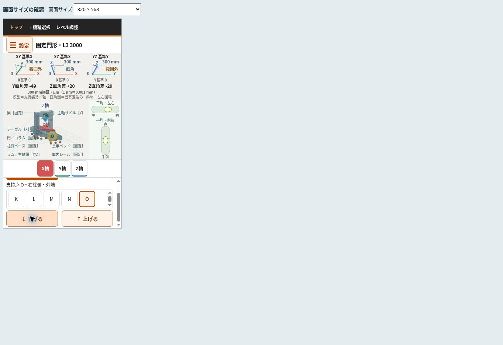
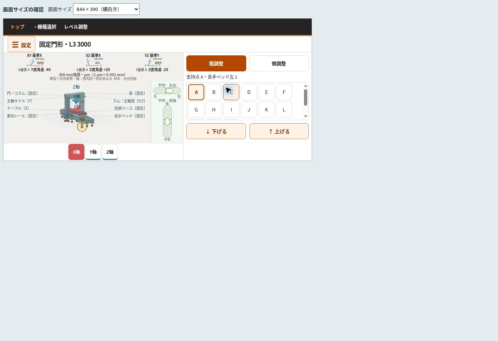

# 案内姿勢・300 mm数値表示の公開確認

公開URL: https://tgkfnfnfv9-stack.github.io/Training-tools/

計算・数値表示: `9d62c487fb45d92b355a0a75bdedc11dc6c16789`

短い画面の修正を含むアプリ版: `7bb9c25c6a231719b207b7fff71202a45f9316de`

GitHub Pagesの両ビルドが成功。最終アプリHTMLのSHA-256は `38c8fbd088298865a0115bb69e65451a08a8346ab433d94f61aeb6b8a7eb1e52` で、公開URLとローカルが一致。

## 自動検証

全33本が最終成功。初回の全実行では31本成功し、変更前の支持参照を前提とした個体例2本を修正した後、対象と関連する計6本が成功。新しい独立検証は案内・部位姿勢213条件、数値表示104条件。確認担当が最終差分も再点検した。

短画面CSS修正後も統合158、数値表示104、設定メニュー581、設定UI173、インターフェース31条件、モバイルナビを再確認した。これらのDOMテストと下記の実レイアウト測定は区別する。

## 実ブラウザー

クラウドChromeを使用。PCは通常のページ、携帯寸法は公開QAページ内のiframe。スマートフォン実機でのタップ・ドラッグ・ピンチは未確認。

|表示寸法|機種数|模型canvas高さ|確認結果|
|---|---:|---:|---|
|1363×936 PC|7|452〜462px|数値表示・幅内収まり成功|
|390×844 縦|7|310〜370px|数値表示・幅内収まり成功|
|320×568 縦|7|161px|数値・水準器・44pxボタン成功|
|320×480 短縦|7|141px|数値・水準器・44pxボタン成功|
|844×390 横|7|169px|数値・水準器・44pxボタン成功|
|568×320 短横|7|99px|数値・水準器・44pxボタン成功|

計42組合せ。PCと390×844は計算・数値版で確認し、影響のある短画面28組合せはCSS修正後に再確認した。390×844の固定門形も最終版で再確認した。携帯28組合せのDOM実測は [browser-dimensions.json](browser-dimensions.json)。すべて横方向のページはみ出しなし。表示値は描画DOM内の非誇張300 mm値を符号付き四捨五入した文字と一致。

短い画面では支持選択・上下調整欄を内部スクロールする。模型と精度表示の位置は固定。320×568で末尾の右柱支持Oを選び、上げ・下げを行ってもcanvasの位置・高さは変化せず、直角差は復元した。[操作記録](narrow-support-operation.json)

## 操作による数値の追従

以下は検証時の個体の一例。普遍的な調整効果や実機の予測値ではない。

- 固定門形の左柱Jを粗5回上げ、Kを粗5回下げると、XYは−49.176→+13.036 µm、XZは+19.577→−7.694 µm、YZは−29.474→−29.957 µmへ変化。設定メニュー開閉とブラウザー再読込で同じ値。操作を戻すと3対とも元の計算値へ復元した。
- 固定門形の右柱外端Oを粗1回上げるとYZは−29.474→−25.460 µmへ変化。下げると復元した。
- 移動コラムAを粗5回上げるとXZは−4.981→−4.374 µm、表示は−5→−4へ変化。同じコラムを参照するYZは+15.855 µmのまま。逆操作で復元した。XYの変化は約0.000023 µmなので整数表示は変わらない。

保存仕様・JSON再現と旧データ拒否は自動検証で成功。実ブラウザーでは自動保存後の再読込で再現を確認した。JSONの保存ボタンは「ダウンロードを開始しました」と表示したが、クラウドブラウザーのdownloadイベント待機がタイムアウトしたため、この環境でのJSONファイル再選択・読込の完了は未確認として扱う。

## 画面

