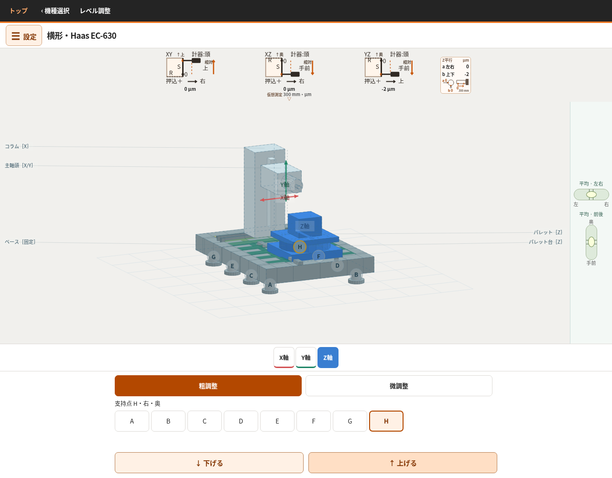
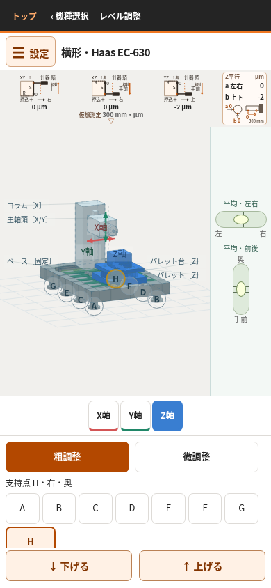
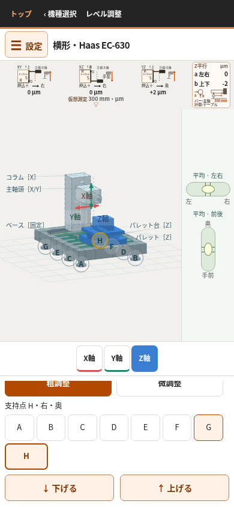

# 横形の直角マスタ・テストバーの取付けと YZ 測定配置の修正

> 後続のユーザー指摘を受け、[横形だけの再監査](../qa-fresh-audit-20261010/README.md)を実施した。以下の一致は採用した仮想配置内の計算確認であり、測定配置全体の妥当性や修正完了を意味しない。YZ方式を変更した判断、局所角度との符号混在、現在位置と測定区間の違い、約1 mの取付け腕を必要とする模型寸法が課題として残っている。

2026-10-10。直前の修正 `87a4adf4644eda872a046dcc3281563542e8fc56` から継続。最新 main を fetch し、`cbdcf81a4b3b252d4113621b8361b20640955688` を確認した。作業開始時は clean。指定の引継ぎ文書を再読した。

## 最新の指示と変更前の確認

ユーザーの指定は「直角マスタをテーブルに置き、主軸側にダイヤル」「主軸にテストバーを付けるときは、ダイヤルをテーブルに置く」。前の質問への回答待ちで止めず、この取付先を固定して調査・変更する。

変更前から、直角測定のマスタはパレット材料座標、計器本体・測定子は主軸頭材料座標に属する。バー測定もバーは主軸、計器はパレットに属する。今回、その所有を逆転させたようには扱わない。旧 YZ は上面接触・パレット Z 送りの配置で、主軸側から縦面を Y 送りで測る配置とは違っていた。ミニ図や共通説明も取付先と実送りを読み取りにくくしていた。

この取付指定を具体的な測定として示すため、統括の設計判断で YZ を「テーブル上の直角マスタの主軸側縦面に、主軸側計器を当てて Y＋へ送る」配置へ変更する。接触側・送りの詳細までユーザーが指定したと読み替えず、今回採用する教材配置として明示する。

横形と無関係な5機種のUI・計算を変更しない。旋盤は従来どおり奥側タレットの計器で主軸固定バーを測り、心押し台は模型だけに残す。「テーブル」という指示を旋盤の架空部材へ置換しない。

## 計算変更前に説明した内容

旧 YZ は頭を Y 送りして R を合わせ、マスタ上面 S に上から当て、テーブル Z 送りで測る。これを同じ値の正負反転だけで縦面測定へ置き換えることはできない。

新配置では、上面 R に上から当てた主軸側計器を固定してテーブルを Z＋へ300 mm送り、始終点を等指示に合わせる。**Rの始終点で測定子がマスタの幅中央線を通るよう、横方向の向きも合わせる。** 直角マスタを固定したままテーブルを選択 Z 位置へ戻す。主軸側の別腕で縦面 S の下端寄りへ接触させ、Y の走査始点でゼロを取り、頭を Y＋へ300 mm送る。途中でRを再調整したり、Sのゼロを取り直したりしない。

横方向の中央線合わせは、式に含まれる設置条件が初回の説明から抜けていたもの。最終の独立3D確認で指摘され、画面手順にも追記した。上面の等指示だけではマスタの横向き角が定まらない。独立反例ではused123456・平坦・中央で、幅50 mmの面内接触とR等指示を保ったまま横向き角を±0.05 radに変えるとYZ表示が−15／−13へ分かれた。中央線を合わせた本配置の−14と区別し、未指定の向きを仮定して『同じ測定』とは扱わない。

パレットの始終剛体姿勢を `(p₀,F₀)`、`(p₁,F₁)`、固定計器の接触世界点を `C` とする。マスタ座標の同一点条件を使う：

```text
c₀ = F₀ᵀ(C − p₀)
c₁ = F₁ᵀ(C − p₁)
nS = normalize(c₀ − c₁)
nR = normalize(up − nS dot(up,nS))
```

`dot(nR,c₁−c₀)=0` を満たすR面で両端等指示を作る。Sはその同じ直角マスタの垂直な面。途中のR接触も有限面と測定子ストロークで確認するが、全点0とは限らない。

接触面の点 `P`、外向き法線 `n`、計器本体 `B`、測定子方向 `d` から伸び `e = dot(n,P−B)/dot(n,d)` を求め、指示を `(e始点−e終点)×10⁶ µm` とする。押込みが増せば正。丸めは従来の整数µmを維持する。

支持・軸位置・寸法・個体を変えた場合は、上記のR合わせ、戻し、S取付け、始点ゼロをやり直す。保存形式と同一個体の乱数は維持し、旧保存の入力から新しいYZ測定を再計算する。XY・XZ・バーa/bの数値は変更対象としない。

器具は320×320×50 mmの教材用直角マスタ。測定時はサンプルワークを外して載せ、R合わせには調整台または調整脚を使って固定する。計器腕は器具を回り込む取付けを具体化する。実器具の剛性・全機械との干渉を解いたという扱いにはしない。

## 分担と独立性

|担当|作業|
|---|---|
|yz_setup_fix|YZの測定計算・有限器具・接触・図・説明を修正|
|bar_mount_audit_fix|バー取付けを実計算で確認、既存図と説明の固定先を明示|
|yz_physical_sign|支持入力と接近・離脱から独立期待値、R/Sと取付けを再検証|
|all_measurement_signs|各部材の実移動・材料座標から計器と基準器の所有を独立確認|
|yz_browser_sign|実操作、前後画像、生値・整数・独立交点、画面の矛盾を確認|
|compatibility_verifier|固定した変更前ソースと比較し、他機種・保存・個体・XY/XZ/a/bを確認|
|統括|結果照合、不一致の再修正指示、凍結版の統合・PRへの反映|

変更前の生成HTMLを [before/index.html.gz](before/index.html.gz) に固定した。先行する模型・姿勢・有限測定の変更は [姿勢修正記録](../posture-response-coordination-20261009.md)、前回の図の伸縮・改善表示修正は [当時の記録](../qa-yz-sign-recheck-20261010/README.md) に残す。本記録で前回の「YZ配置は未採用」を更新する。

## 修正結果と独立期待値

YZは上面S・テーブルZ走査から、主軸側の縦面S・主軸頭Y＋走査へ変更した。単に数値へ−1を掛けず、R校正、戻り、腕の取付け、S接触と始点ゼロを計算している。バーa/bは計算上の取付先が既に正しかったため数式を維持し、図と説明を実配置へ揃えた。

次は実ブラウザーの同一支持入力による前後比較。単位はµm。「生値／表示」の右側は画面の整数。標準寸法、X=Y=0。G/Hの例はZ=−100、usedの例はZ=0・seed123456。各操作は平坦支持から開始し、記載以外の支持は0。

|個体・支持操作|旧YZ 生値／表示|修正YZ 生値／表示|支持入力からの独立3D期待|
|---|---:|---:|---:|
|理想・平坦|0／0|0.000000000111／0|ほぼ0|
|理想・G/H各＋0.010 mm|−2.445652174／−2|＋2.445652174／＋2|＋2.445652174|
|理想・G/H各−0.010 mm|＋2.445652174／＋2|−2.445652174／−2|−2.445652174|
|used・平坦|＋14.119999995／＋14|−14.119999995／−14|−14.119999995|
|used・B＋0.010 mm|＋12.543911945／＋13|−12.544071703／−13|−12.544071703|
|used・E＋0.010 mm|＋14.989567756／＋15|−14.989758773／−15|−14.989758773|

左右非対称のB/Eや中古個体も含む61状態すべてで、支持8点→独立最小二乗と面の接線→個体の軸角度制約→R校正の角度探索→Y送りの面への接近量、という別計算と一致した。期待値は製品の姿勢・測定関数から取得していない。最大差3.11×10⁻¹⁰ µm、整数表示も一致。[完全独立3D計算](physical-browser-3d.json)、[計算スクリプト](../../tests/check-horizontal-fixture-independent-3d-20261010.cjs)、[全5値の前後・独立期待CSV](browser/raw-display-expectation.csv)。

支持操作後に値が変わらない例も残して調べた。例えば理想中央B＋0.010 mmでは、XZ生値は0→＋0.468151644 µmとなるが整数は0のまま、YZは0→＋1.576082780 µmで＋2、aは＋1.340483855 µmで＋1、bは−2.554398789 µmで−3。XYが0を維持する理由を含め、[固定表示の切り分け](fixed-values.md)に記録した。全値を強制的に動かす処理は入れていない。

## 前後の実ブラウザー画像

同じG/H＋0.010 mm操作、理想、X=Y=0・Z=−100。

|変更前：YZ −2 µm|最終修正版：YZ ＋2 µm|
|---|---|
|||
|||

[ブラウザー確認記録](browser/README.md)には支持上下、戻し、軸操作、PC/mobile、カード内スクロールを保存した。独立担当がバー図の文字欠けを検出し、修正担当へ差し戻した。文字位置と下余白だけを再修正し、最終版で文字境界・表示を再確認した。[最終バー詳細図](browser/final/bar-detail-svg-390.png)、[最終確認](browser/final/smoke.json)。

## 確認範囲と維持した仕様

- [実装記録](measurement-fix.md)：180状態、6,552接触、32,760腕線分。XY/XZの360比較は変更なし。
- [独立物理確認](physical-review.md)：左右同高324状態を支持断面から再計算。さらに上記61状態を完全3Dで再計算。Rの途中は常に0ではなく、端点等指示・有限接触・ストロークを別に確認。
- [独立所有監査](ownership.md)：96状態、42,364比較。R/Sの点・法線・計器・腕を材料座標へ戻して取付先を確認。XY/XZ/a/b/旋盤の384記録は生値・接触・腕・ゼロまで前後一致。
- [バーの別計算](bar-mount.md)：72状態の固定先・円筒接触。主軸固定バー、テーブル固定計器、走査中の取付け維持を確認。
- [互換性確認](compatibility.md)：336状態、全7旧保存、42個体。他5機種と旋盤の数値・3D・UIを維持。実Chromium24画面は差分0 pixel。最終の余白修正後も4画面・3機種の実保存読込を再確認。

旋盤は奥側タレットの計器と主軸固定バーを維持。心押し台は3D模型だけで、精度計算に追加していない。テスト加工・心押し検査項目を戻していない。整数µm、既存操作、保存schemaを維持し、旧横形保存は同じ入力・同じ個体から新YZを再計算する。

新YZの計器腕と320角マスタについて、912状態・166,440線分で半径4 mmを含む距離を別計算し、最小隙間5.608 mm。これは器具間の検査であり、全機械部品との連続衝突、たわみ、実機精度の検証ではない。

前回から残る旧モデル前提の既存4テストの失敗は [履歴](../qa-yz-sign-recheck-20261010/verification-notes.md) に記載し、合格扱いにしていない。今回の配置変更に直接関係する改善表示と説明切替の回帰は、旧数値の固定期待を使わず新配置の独立交点・所有・他機種への復元を検査するよう更新した。

## 最終成果物

最新mainは完了前の再fetchでも `cbdcf81a4b3b252d4113621b8361b20640955688`。最終生成HTMLは [final/index.html.gz](final/index.html.gz)、SHA256 `a33e7a9efc3094f41d51bbf48ca541176d8e9984aa3774a5d5ff3ec54edfbf7c`。数値の全件ブラウザー確認版 `5231b54f…` との差はバー説明図の文字2箇所とviewBox高さ、およびR中央線合わせの説明3箇所。計算関数が同一であることと最終HTMLの実操作を別担当が確認した。

[PR #32](https://github.com/tgkfnfnfv9-stack/Training-tools/pull/32) にまとめた。mainへのマージと公開サイトへの反映は行っていない。
