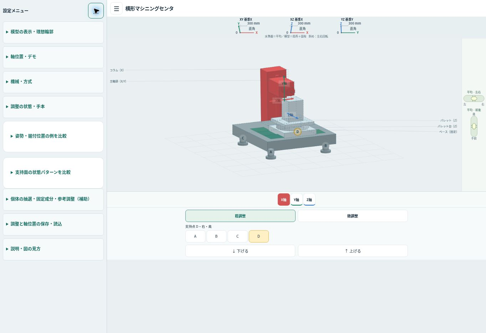
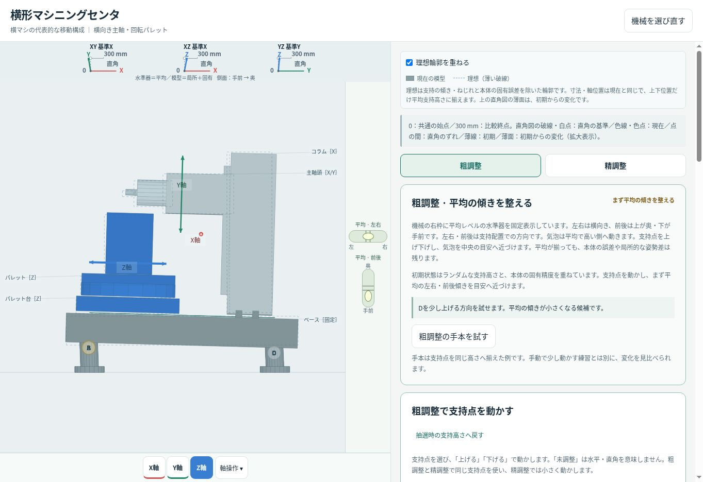
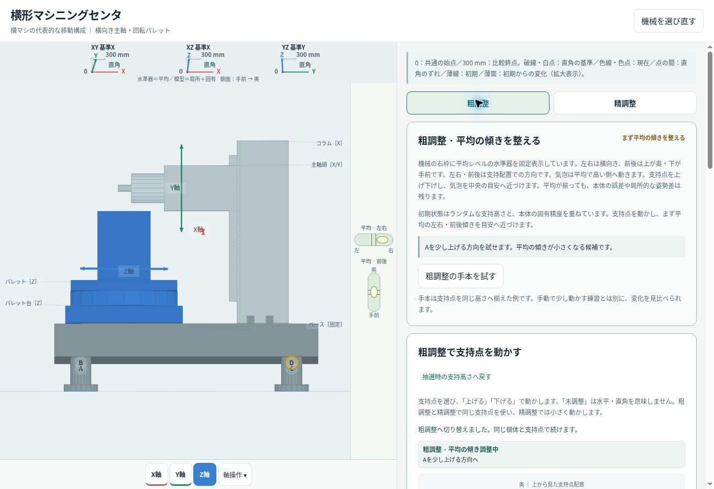
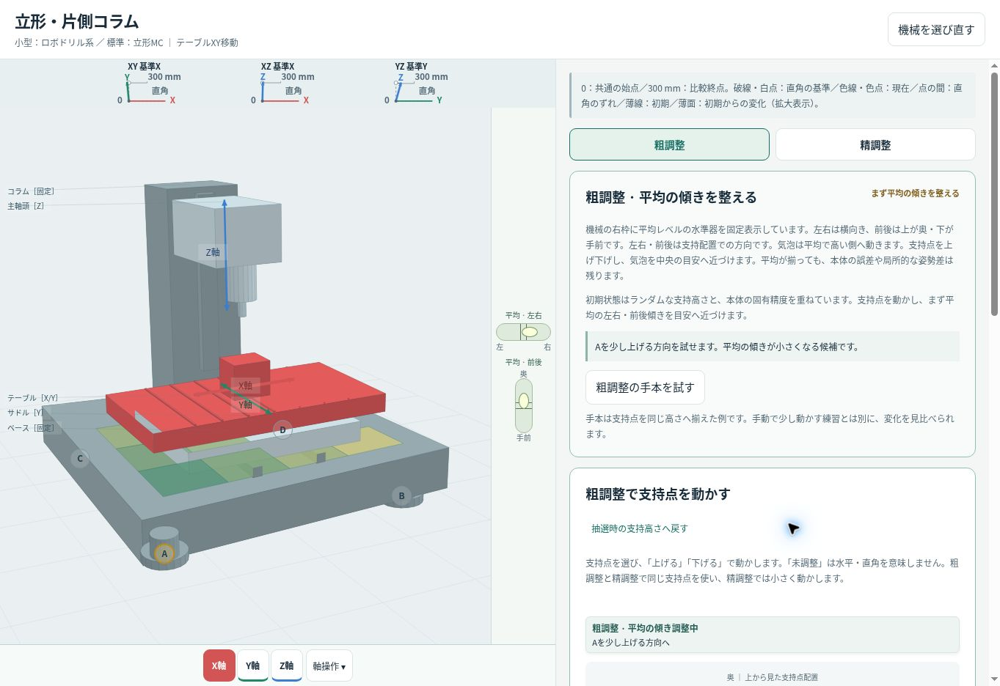
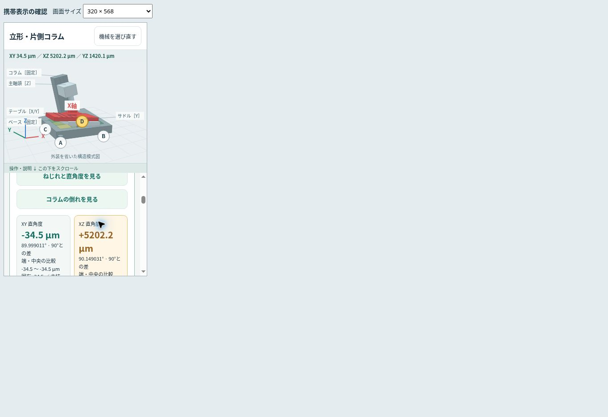
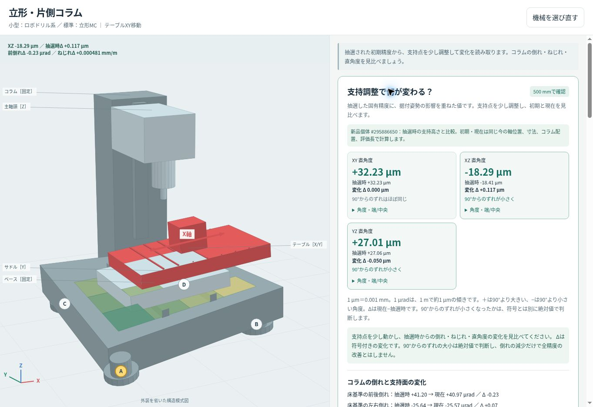
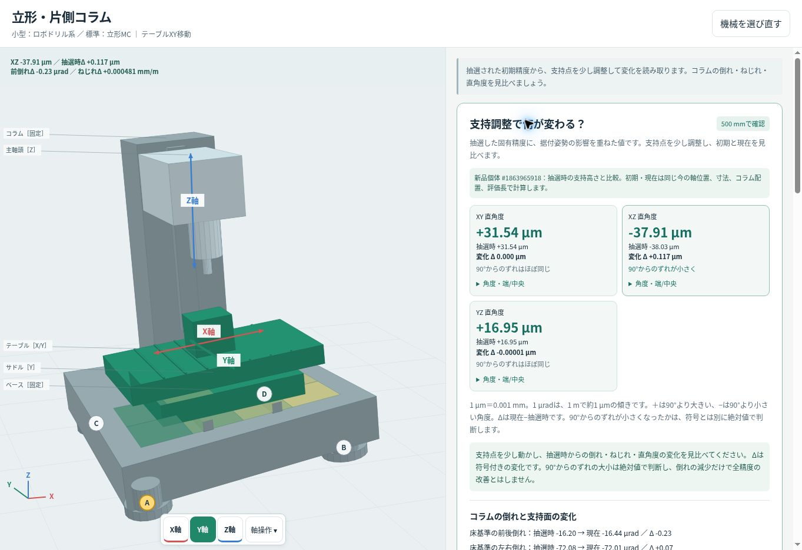

## 調整専用欄と左側の設定メニュー（2026年10月5日）

利用者が承認した配置案に基づき、開始時の最新main `195c03f5fe6e41403d38f1a7a787aa5250dd2996` から変更した。主画面の調整欄には粗調整／微調整、支持点の選択、選択点の共通上下ボタンを残し、細かな設定と説明を左上のメニューへ集約する。

主画面の上下操作は粗0.01 mm・微0.001 mm。旧JSONを読み込んだだけでは旧stepを含む内容を変更せず、共通上下ボタンで操作を始めた時点で選択段階の規定量へ揃える。個体・初期比較の基準は変更しない。数字を隠した既存の教材表示も維持する。

メニューは独立スクロールし、開いている間は機械・水準器・直角図・軸バーを含む主画面全体を右へ縮小する。縮小中の主画面への誤操作を防ぎ、閉じると通常の表示と操作へ戻る。この表示倍率は模型のズーム値とは別に保持する。表示設定、軸位置と動作デモ、機械・方式、据付設定、個体と手本、保存・読込、図の見方をメニューから利用できる。

修正担当、UI確認担当、機能確認担当の3サブエージェントで分担した。

機能担当の `tests/check-settings-menu.cjs` は610項目成功。全9方式・45支持点、共通上下の規定量・選択点だけの変更・高さ制限、軸位置、動作デモ、保存・読込、旧stepの互換性、メニュー開閉による表示以外の不変を検証した。変更前後72ケースでは支持高さ・個体・精度・初期比較・軸位置・参考最良・保存JSONなど13項目が完全一致した。機種切替の途中で旧個体を参照して描画する例外を独立確認で発見し、初期化後にメニューを閉じる順序へ修正して再確認した。

UI担当の `tests/check-settings-menu-ui.cjs` は221項目・364 Canvasフレーム・約168万の有限座標が成功。9方式×7表示サイズ（320×480の短い縦画面を含む）で開閉前後の描画、全体の縮小、独立スクロール、背景操作の抑止、Tab/Escapeとフォーカス復帰を検証した。ズーム検証は98項目で、メニューを開いた際のピンチ終了と閉じた後の回転・ズーム再開を追加した。既存の配置・文言の期待値を新UIへ更新し、数値計算・JSONの期待値は維持した。

既存23本＋新規2本の自動検証全25本が成功。機種切替修正後、関係する精度描画425フレーム、調整フロー189項目、表示移動1,211項目、統合194項目、理想形1,066項目も再実行して成功した。`python3 build.py` と `git diff --check` が成功。

PR #28をマージした `14bc4d980fc9865b3c14b1e5de9acac318c82777` のPages公開成功を確認した。公開Chromeで390×844・320×568・568×320・844×390・1024×768のiframe、および1363×936の直接ページを確認し、横はみ出しはなかった。

- 移動コラムの支持点Aを粗1回・微1回上げると、非表示の調整量は0.000→0.011 mm。主画面は粗／微・選択点・共通上下だけで操作できる。
- 390pxで設定メニューを開くと左144px、右主画面246pxへ一体縮小。設定欄のscrollTopが0→1745pxへ動いても右主画面の矩形は不変、ページ本体はscrollTop 0。Escapeで閉じるとscale 1へ復帰した。
- 320×568の8支持モデルでもA〜Hと共通上下が画面内に収まり、上下操作の下端は558px。機械・水準器・軸バーの枠を維持した。
- 320pxで5軸のA/Cを選択し端まで動かせる。568×320では模型・水準器を左、調整を右へ配置し、XYZAC全ボタンを表示。旋盤はXZだけで、デモ開始後に一往復して停止した。
- PCのネイティブホイールで拡大／縮小し、ドラッグ回転と切り替えられる。メニューの表示設定で観察方向、標準倍率へ戻す操作も確認した。
- 横形の全支持を同高にした後、奥のDを粗1回上げると前後気泡が50%→49.479%へ動き、高くした奥（上）の方向へ追従した。現在の模型と薄い理想輪郭を引き続き重ねて確認できる。
- 携帯サイズはChrome iframeによる確認で、スマートフォン実機での指操作は未確認。ピンチと回転の切替はPointer Events自動検証98項目で補った。320×480の短い縦画面も自動UI検証の対象とし、この寸法の実ブラウザー確認は行っていない。

UI担当が下記の公開画像6枚を独立に目視で再確認し、操作を塞ぐ重なりや欠落は見つからなかった。小幅の模型上の支持ラベルは密集するため、下欄の支持選択とズームを併用できる。

公開画面：[携帯縦](qa-menu-mobile-20261005.jpg)／[携帯でメニューを開く](qa-menu-open-20261005.jpg)／[320px](qa-menu-320-20261005.jpg)／[320px・8支持](qa-menu-320-eight-20261005.jpg)／[携帯横・5軸](qa-menu-landscape-20261005.jpg)。

---

## 現在模型へ理想輪郭を重ねる（2026年10月5日）

利用者の図案承認後、最新main `0483bca5919fef97eaf33f38b74c48815a4f2536` を確認して実装した。現在の模型は支持点の調整と本体固有誤差に従って動き、薄い破線で重ねる理想形は支持の傾き・ねじれと固有誤差を除く。同じ寸法・配置・軸位置・視点・ズームを使い、上下位置は平均支持高さへ合わせる。理想は数学的な比較基準で、支持調整だけで到達できる状態を保証するものではない。

輪郭は面を塗らず、現在の面の後・支持マーカーや軸矢印やラベルの前に描く。支持足・ねじ・細いレールの複製を省き、円筒の細分割の継ぎ目は外形となる辺だけ残す。表示切替と凡例を独立スクロールする操作欄の先頭へ置き、固定模型の表示領域は維持した。直角図の初期比較の薄面とは説明を分けた。

修正担当、UI確認担当、機能確認担当のサブエージェントを分けた。機能担当の `tests/check-ideal-display.cjs` は1,066項目が成功。648条件・411,264頂点を独立した物理寸法換算と回転の期待値へ照合し、最大差は2.05×10⁻¹⁵m。固有誤差なしの平坦状態で現在形と理想形が一致する162条件、支持調整、固有誤差の除去、公称のXYZ移動、A/Cの剛体辺長、表示切替・回転・ズームの計算と保存不変を含む。全9方式×新品／中古×初期／粗手本／精参考例／軸位置変更の72ケースでも、変更前後の支持高さ・個体・精度・初期比較・軸位置・参考最良・保存JSONを含む13項目が完全一致した。

UI担当の `tests/check-ideal-outline-ui.cjs` は953チェック・1,006 Canvasフレーム・約430万座標が成功。全9方式×5表示サイズ×3視点×3倍率を含み、表示切替で従来の模型・軸・支持点・ラベルの描画は一致し、破線だけが追加されることを確認した。円筒の細分割線を抑えて胴体の輪郭2辺を残し、最大線分数は従来模型辺の23.5%以下だった。既存21本と新規2本の全23検証が成功。既存軸操作テストは、操作欄先頭へ表示切替を追加した配置の期待値だけを更新し、精度・保存の検証は変更していない。ピンチと回転の切替は既存97項目のPointer Events検証で確認した。

PR #27をマージした `f17096cece1b0d69671bc5c83b84fa55548497c4` のPages公開成功を確認。公開Chromeで390×844・320×568・568×320・844×390・1024×768のiframe、および1363×936の直接ページを確認し、全サイズで横はみ出しなし。表示切替は初期オンで、オン／オフの案内と描画が切り替わる。

- 横形の側面で、手前高の気泡は下、現在の柱は奥へ傾き、理想輪郭は鉛直を保つ。粗手本で前後気泡の位置が70.833%→50%へ戻り、奥のDを上げると49.479%へ動く。現在の模型も支持調整へ追従する。
- ネイティブのマウスホイールで拡大・縮小し、続くドラッグで回転へ切り替えられる。Homeで標準倍率へ戻した後の再拡大も確認した。輪郭は現在形と同じ投影・倍率で動く。
- PCの操作欄scrollTopが1193→0pxへ変わっても、模型と水準器の矩形は不変。390px画面でも操作欄が0→1402pxへ動く間、模型の矩形は不変、ページ自体はscrollTop 0。
- 320pxの5軸ではXYZACのバーが一行に入り、A/Cを端へ動かしても輪郭と現在形が追従する。1024pxでは旋盤がXZのみを表示し、動作デモが開始・一往復後に終了する。
- 携帯サイズはChromeのiframeによる確認。実機の指によるピンチは未確認で、Pointer Eventsの自動検証で補っている。小さい画面で微細な姿勢差を読む場合はズームを併用する。

UI担当が下記の公開画像5枚を独立に目視で再確認し、表示矛盾や操作を塞ぐ重なりは見つからなかった。

公開画面：[携帯縦](qa-ideal-mobile-20261005.jpg)／[320pxの5軸](qa-ideal-320-five-axis-20261005.jpg)／[携帯横](qa-ideal-landscape-20261005.jpg)／[PC標準倍率](qa-ideal-side-pc-20261005.jpg)。

---

## 水準器と模型姿勢の整合性の再監査（2026年10月4日）

開始時の最新mainは `c8d118fd492cc13c30049ccb1f15fe212c44fd7a`。利用者の横形MCの側面画像を受け、UI確認・機能確認を別担当、修正を第三の担当に分けて再監査した。

旧版では平均水準器の符号は正しかったが、次の描画の不一致があった。前回の検証は気泡と計算値、描画の有限性などを確認したもので、以下の投影・局所面法線・実移動差分までは検出できていなかった。

- 遠近投影により、鉛直な柱にも側面で見かけの倒れが発生した。水平な横形の例で約0.93°。わずかな奥高では、本当は手前へ傾く柱の上端が画面上では奥へずれる例も再現した。
- 支持高さを固定サイズの外形へ描く一方、柱は仮想支持寸法で計算した勾配で回していた。支持寸法を変更するとベッド面の法線と柱の支持姿勢が一致しなかった。
- 支持足全体が支持姿勢で動き、底が床から浮く／床へ潜る場合があった。
- 固有差のある個体では、一部の可動部の並進が公称方向、矢印が固有方向となり、両者の向きが一致しなかった。

修正後は正投影、正面／側面の観察方向、床の鉛直／水平基準線を使う。支持面と部材は同じ仮想寸法に写像し、同じ局所支持勾配を参照する。支持足の底を固定床へ置き、支持ねじをベッド下面へ接続する。

水準器は全支持の平均、柱は局所支持と固有誤差の合成である。平均が目安内でも局所ねじれや固有誤差が残ることは矛盾ではない。四点のねじれでは平均前後がゼロでもX位置を変えると柱の局所前後傾きが変わり得る。平均気泡と柱上端が必ず逆へ動くという判定は用いない。

独立した機能確認では変更前後の全9方式×新品／中古×初期／粗手本／精参考例／軸位置変更の72ケースについて、支持高さ・個体・精度・初期比較・軸位置・参考最良・保存JSONが完全一致した。`tests/check-model-posture.cjs` は1,804項目を追加し、実Canvasへの独立正投影照合、気泡と柱の正負、平均と局所姿勢の区別、支持面法線、足の床接地と接続、仮想寸法0.5〜20m、5軸の剛体辺長、320px幅相当の最小Canvasまで確認する。

`tests/check-display-motion.cjs` は1,211項目で、複合傾斜と平面の実移動、ねじれ面の柱根元の接触、根元が動かない内部軸、平均ゼロでも局所・固有差が残る例を確認。最終候補は既存19本＋新規2本が成功した。描画座標契約の変更に合わせて既存検証の物理寸法・正投影の期待値を更新し、数値精度・保存の期待値は緩和していない。

PR #26をマージした `89f4a055905be6cc761631973fd00d7115add0a7` のPages公開成功を確認し、公開Chromeで390×844・320×568・568×320・844×390・1024×768のiframe、および1363×936の直接ページを確認した。全寸法で横はみ出しなし。UI担当が保存した実画面を独立に再確認し、表示矛盾や操作を塞ぐ重なりは見つからなかった。

- 横形の「右側が高い」では前後気泡が中央、側面の柱が鉛直。「手前が高い」では気泡が手前（下）へ、柱の上端が奥（画面右）へ移ることを実画面で確認。
- 全支持を同高へ戻して奥のDを上げると、前後気泡が中央から奥側へ追従。
- 実マウスホイールによる模型拡大／縮小、続くドラッグ回転、Homeによる表示倍率復帰を確認。ホイール中は正面／側面の観察方向を保持する。
- 説明欄のscrollTopが1549→2485pxへ移っても模型と水準器の矩形は不変、ページ自体はscrollTop 0。
- 320pxでもXYZAC＋軸操作が一行に入り、A/Cの位置操作が可能。旋盤はXZのみ、動作デモは開始して一往復後に終了する。
- 小幅の初期模型は小さめで、微細な姿勢差はズーム併用で読む。気泡・中央目安・方向・軸名は判読できる。携帯サイズはChrome iframeで確認したもので、スマートフォン実機の指操作は未確認。実タッチAPIがないためピンチは97項目のPointer Events検証に含めて確認した。

公開画面：[携帯縦・側面](qa-posture-side-mobile-20261004.jpg)／[320pxの5軸](qa-posture-320-five-axis-20261004.jpg)／[携帯横](qa-posture-landscape-20261004.jpg)／[PC標準倍率](qa-posture-side-pc-20261004.jpg)。

---

## 機械表示の平均水準器とピンチ／ホイール（2026年10月4日）

作業開始時のmainは `add4afc51cc10259599ab55ac904bd3bdafbfe6e` と一致しました。

- 平均水準器を固定表示の専用右枠へ移動。左右は横向き、前後は縦向きで上が奥・下が手前。支持勾配と同じ高い側へ気泡を動かします。機械・支持点・軸矢印・直角図に重ねません。
- 模型のピンチ／ホイール／キーボード倍率を表示専用で保持。Canvas投影だけを変更し、計算エンジンと保存schemaは変更していません。
- 二本指では回転を止めて距離比で倍率を変えます。指が減ったときに基準を取り直し、pointerup／cancel／capture喪失／画面退出で操作を片づけます。操作・説明欄は独立してスクロールします。
- UI担当と既存機能担当のサブエージェントを分け、指摘を修正担当へ渡して再確認しました。

変更前の既存18種類、変更後の既存18＋新しいズーム検証1の全19種類が成功。検証中のsrc/testsのハッシュ不変も確認しました。新しいズーム検証は81項目・213描画フレーム・820,587有限座標、独立した既存機能担当の操作確認は126項目・181描画フレーム・368,742有限描画操作です。変更前後の全9構造／方式×新品／中古×初期／粗手本／精参考例／軸位置変更の72ケースで、支持高さ・固有個体・精度計算・初期比較・参考最良・保存JSONを独立に照合し、全項目が完全一致しました。

Canvasの追加確認では、水準器枠追加後の小幅・小高さを含む6寸法（232×161、232×112、302×315、384×220、230×150、623×697）×全9方式×4視点×全軸選択の672フレームで、全2,208軸名を表示し、ラベルの画面外配置・ラベル同士・支持点との重複がないことを確認しました。

公開版 `39213583c330ce71ac9f1fcf40af9387dfd44a76` はPR #25のマージとPagesデプロイ成功を確認。公開Chromeで390×844、320×568、568×320、844×390、1024×768のiframeと、1363×936の直接公開ページを確認しました。水準器は専用右枠に収まり、機械・支持点・軸矢印・上の直角図・下の軸バーを覆いません。320pxでも5軸のXYZACと軸操作が1行に収まり、旋盤はXZだけです。携帯縦横とPCの画像はUI担当が独立に再確認し、未解決のUI指摘はありません。

実操作では支持点を上げると平均水準器が追従し、奥が高いと気泡が上、手前が高いと下、右が高いと右へ動くことを確認。粗／精の切替でも水準器を保持します。マウスホイールの拡大縮小後もドラッグで回転でき、Homeキーで表示倍率だけを戻せます。携帯の支持操作による説明欄スクロールとPC右欄末尾へのスクロール（scrollTop 1252px）の間、模型・水準器・直角図・軸バーは同じ位置に残ります。各確認寸法で横はみ出しはありません。

携帯寸法は `docs/qa-mobile.html` のChrome iframeによる確認です。ピンチの開始・距離変更・回転抑止・指の増減・解放後の回転・倍率制限はPointer Eventsの自動検証で確認しました。ローカル環境のChromeバイナリ取得が失敗し、クラウドブラウザーには実タッチ入力APIが提供されていないため、CDP実タッチとスマートフォン実機での指操作は未確認です。

公開実画面：[携帯縦](qa-viewer-levels-portrait-20261004.jpg)／[携帯横](qa-viewer-levels-landscape-20261004.jpg)／[320pxの5軸](qa-viewer-levels-320-five-axis-20261004.jpg)。

---

# 全訓練機能の検証

## 現在の実装

機械は固定乱数の新品／中古個体とランダムな初期支持高さから始めます。「粗調整」は平均の方向と気泡、「精調整」は直角の初期／現在／変化、合成姿勢と全代表位置の総合評価を示します。共通の支持点を上下操作し、精度値・操作量・seedは学習画面へ数字を出しません。測定位置の専用目印「0」「O（0,0）」「300 mm」は表示します。数値入力・旧詳細はhiddenで保持し、精度計算・個体・保存schemaは維持。模型は固定表示、説明・操作欄は独立スクロールです。電気の教材は維持しています。

## 直角図の常時凡例（2026年10月4日）

白点・破線は理想の直角、色点・色線は現在、点を結ぶ線は直角との差であることを、粗調整でも読める常時凡例に追加しました。薄線は初期、薄い面だけが抽選時から現在までの変化だと説明を揃え、図全体を累積変化と誤読しない文面へ修正。専用の始点0・300 mm比較終点ラベルは維持します。

変更は説明文とその生成物のみで、図・CSS・計算・data属性・保存は維持。直角表示95項目、調整フロー189項目が成功し、生成物の再ビルド一致と差分チェックも確認しました。公開後は携帯の縦横・320px幅・PCで凡例の折返しと固定表示を確認します。

## 直角図の測定始点と固定比較終点（2026年10月4日）

固定図と詳細図へ共通始点0・測る軸の矢先・300 mm比較終点を追加。XYはX基準でY、XZはX基準でZ、YZはY基準でZ、旋盤XZはZ基準でXを測ります。白い理想終点と色の現在終点を結ぶ線は直角との差、薄い面は初期からの変化です。始点O（0,0）は測定開始時のゼロ合わせで、初期精度をゼロにしません。現在位置の局所角度を固定長へ換算した模式比較で、実NC座標・実移動・ガイドの全域走査ではないと説明します。

既存の固定図の高さ・原点・線長・gain5000・表示限界を維持し、精度計算と保存は変更しません。300 mm換算は実偏差×0.3のdata属性だけに保持。`check-squareness-display.cjs` は95項目で測定軸・始点・両終点・差線を照合し、評価長を変えても固定換算が計算状態／保存を変更しないことを確認します。`check-adjustment-flow.cjs` は189項目。数字例外は専用位置ラベルの完全一致に限定し、「0 µm」「300 mm 0 µm」「400 mm」「0.001」が混ざる場合は検証で拒否します。精度・操作数値の非表示検証を維持します。

常時図の目印は13pxのSVG文字で、既存の図高さを保ちます。横向きの狭い操作欄では詳細の大図の文字が小さくなるため、図の軸対あたり88px（通常264px、旋盤88px）の最小幅を確保し、フォーカス可能な図内の横スクロールへ分離しました。機械の描画領域とページ／操作欄の横幅を広げません。

修正後の全18スイートが成功。独立機能レビューの904項目／796描画は、全基準と測定方向、理想／現在の端点と差線、固定換算、初期変化面との区別、評価長・JSON・精開始時基準の不変を確認しました。旧90完全状態との厳密一致と、相対入力／保存459項目も成功しました。

最終候補の独立UIレビューは2,483項目／15,585可視候補／150図が成功。ラベルの余白、点を引出し線の後に描く順、軸対数に応じた大図の最小幅、数字の限定例外、図のフォーカスと左右案内、固定図42／48px、描画前後の保存状態不変を確認しました。対象95／189項目も最終候補で再成功。実ブラウザーの文字境界と320px縦・390px縦・568px横・PCの確認は公開後に行います。

公開後の568×320実ブラウザーで、詳細図の最小幅が親gridのauto最小幅へ伝わり、操作欄が横にはみ出す問題を確認しました。操作列をゼロ最小幅の列、精カードを最小幅ゼロ、図wrapperを親幅に制限して、図だけを横スクロールさせます。計算・データ・図の最小文字幅は変更しません。対象95／189項目が再成功し、表示テストには祖先の縮小条件のガードを追加。公開後はカードが操作列の幅に収まり、操作欄のscrollWidthが増えず、通常図だけwrapper内を左右へ動かせること、旋盤単独図は不要な横スクロールを持たないことをDOM寸法で再確認します。

## 非数値の粗／精調整と直角変化（2026年10月4日）

粗と精は独立パネルで、支持点の上下操作は共通です。新規は粗、旧記録のstepは保持して段階を推定。明示切替は操作量だけを変更し、個体・実支持高さ・抽選時基準を変えません。粗完了を精への必須条件とせず、精画面でも平均の状態を説明します。

上部直角図は、直角基準の破線・薄い初期線・現在線・実差の変化面を同じ現在位置で表示します。固定5000倍を全図へ共通適用。初期／現在の両方の表示限界を確認し、広がる／狭まると直角に近づく／離れるを区別します。同じ剛体側・平面支持で変化しない組へ変化面を作りません。数字を伏せたDOM・読み上げでも、内部data属性は真値のままです。

粗の手本は既存の同高処理、精の参考例は既存参考支持高さを実際に適用し、実評価から目安を再判定します。粗ヒントは平均傾き、精ヒントは既存全位置objectiveを実評価し、改善する単独候補だけを示します。精開始時の総合比較をUIだけに保持し、初期との差の図と区別。読込・初期戻し・別支持問題・個体／条件変更ではUI比較を破棄し、保存schemaは追加しません。

既存17種類の数理・保存assertを維持し、可視文言・seedの内部属性・明示精選択・図の固定倍率の期待だけを更新しました。新しい `check-adjustment-flow.cjs` の189項目を含む全18スイートが成功。全9方式×新品／中古の段階操作、実ヒント、手本適用、総合改善と初期直角の悪化が両立する実個体、合成残差の原因を本体だけに帰属しない表示、平面支持の不変、legacy全step、基準破棄、signed方向と絶対改善、双方のclamp、実ヒントの単独停滞と参考例による実到達を確認します。最終生成物の179静的IDに重複はありません。

独立UI担当の5121項目は、粗／精と全方式の非数値DOM/ARIA、gain5000・正負／ゼロ／双方clamp、線端点と文字の範囲、支持mapの45個の一意な文字付き名前、軸操作focus/Escape復帰、段階／支持操作時のfocus保持を確認しました。現在全位置の合成直角差やガイドPVが大きい場合も、実機合格や各直角すべての改善を宣言しません。閾値と計算上の意味は `leveling-model.md` を参照してください。

独立機能担当は旧90完全状態を明示した同じstepで照合し厳密一致、相対入力／保存459項目と追加1045項目が成功。追加走査は162個体条件の参考最良実到達、全9方式×新品／中古のヒント手動降下、legacy／context／偽成功を確認。単独精操作で停滞する移動コラム新品・固定門形中古の実支持状態も、未完了を維持した後に参考例で到達しました。

## 支持点操作中の短い固定案内（2026年10月4日）

公開画面の320px縦で、共有支持点を操作すると長い状態・ヒントが画面外へスクロールする問題を確認しました。共有案内を「粗／精＋状態」「実候補の支点と方向」の短文へ変更し、支持カード内だけ `position:sticky;top:0` で保持。詳細な理由と注意は既存の粗／精パネルへ残します。

目安内の場合は候補方向より達成状態を優先し、単独候補がなければ参考例を案内します。短文はそれぞれ20文字以内、上下ボタンと行には84pxの上端スクロール余白を設定。計算・候補評価・記録・初期図と精開始時の比較基準は変更しません。新フロー188項目の期待を全文コピーから、実候補支点／方向の一致・目安優先・停滞・短文長へ更新しました。支持操作中の貼付位置と最初／最後の上下ボタンの可視性は公開ブラウザーで再確認します。

修正後の全18スイートが成功。独立UIの18,853項目は全方式／状態／段階の短文・実方向・目安優先・非数値・支持カード内stickyとフォーカス余白を確認。独立機能の159項目、旧90完全状態の厳密一致、相対入力／保存459項目も成功し、計算・保存・初期図・精開始時比較の維持を確認しました。

## 前版：初期数値の非表示と基準軸に対する直角図（2026年10月4日）

支持点入力は「抽選時からの調整量」に変更しました。初期0は未調整を意味し、水平・直角を意味しません。入力を元の支持高さへ変換して、従来の物理範囲と0.001 mm丸めで計算・保存します。初期高さ、個体の固有成分、抽選時とのΔの可視数値は削除し、現在の精度・倒れ・ねじれ・補助水準器は維持。参考表の初期行を外し、現在／参考最良の補助比較を残しました。

機械の上の既存要約欄を、XY/XZ/YZの直角図へ置換。XY/XZはX、YZはYを水平基準に固定し、旋盤は主軸Z基準のXZだけです。90°は破線、現在の他軸は色線。実角の偏差を1000倍固定で拡大し、正は90°より広く、負は狭く描きます。±0.65 radの表示限界を超える場合は「図の範囲外」を明記。詳細欄も同じ図計算を使います。図は視点回転ではなく軸間の相対角を示し、支持調整と軸位置に追従します。

修正担当の `node tests/check-squareness-display.cjs` は90項目成功。線の角度を端点から逆算して実測の偏差と照合し、正／負／0、倍率固定、限界、全9構造／方式、全軸対、支持調整と軸位置への連動、共通の平面傾斜での直角差不変、初期数値の非表示、相対入力と絶対保存、初期戻しを検証します。既存テストの数理・保存の期待値は維持し、可視文言と入力座標の期待だけを変更しています。

機能レビュー担当は旧mainの90完全状態と変更後を照合して厳密一致。別の独立459項目で相対入力の初期表示、全支持点の±操作、物理範囲、無効／空入力、編集中の丸め、絶対値API、v2/旧JSON読込と書出し、遅延読込、粗／微切替を確認しています。精度・個体・初期高さ・支持高さ・参考最良・保存schemaは維持しています。

## JSON書出しの開始処理（2026年10月4日）

保存操作で生成するBlobの内容・JSON schema・機械と方式のファイル名を維持し、非表示のダウンロードリンクを一時的にbodyへ接続してクリックします。リンクはfinallyで除去し、Blob URLはブラウザーの開始処理に時間を確保するため30秒後に解放します。Blob生成・URL生成・要素生成・DOM接続・クリック・解放予約のいずれかが失敗した場合は、開始済みと表示せず、作成済みの一時資源を片付けて再試行の案内を表示します。

`check-leveling-ui.cjs` に8検査を追加し、189項目成功。クリック時だけリンクがlive DOMへ接続されていること、hiddenで画面やタブ順に現れないこと、同期操作後の親DOM復元、JSON内容・ファイル名・記録の維持、30秒までのBlob URL保持、6段階の例外処理と失敗後の再試行を確認しています。開始表示はブラウザーに開始を依頼したことを示すもので、実ファイル取得までの完了表示ではありません。

公開ブラウザーの書出し確認は、クリック前にdownloadイベント待機を登録し、取得した実JSONの内容とファイル名を現在の保存記録へ照合します。保存／読込で個体・支持高さ・基準軸の図が同じ状態に復元することも別途確認します。

## 自動検証

READMEの19個のNodeコマンドをリポジトリ直下から実行して再現できます。純粋な支持モデルのUI／旧精度テストはテスト環境の `pureLeveling:true` で固有抽選を分離。製品の初期状態は常に固定乱数個体です。新機能はdefault環境で独立確認します。

|検証|結果|
|---|---|
|レベル計算|83検査成功：平面、一様上昇、符号、単位、ねじれ、中間支持、退化入力|
|レベルUI|189検査成功：全7機種と方式、0.001 mm丸めと三桁入力、範囲、位置／寸法／感度、練習、保存読込、一時リンクの接続・除去と遅延解放、書出し失敗の復旧|
|姿勢・直角度エンジン|73検査成功：直交フレーム、共通平面、一様上昇、四点ねじれ、符号、評価長、入力検証|
|支持精度の独立レビュー|84検査成功：全9構造／方式、YZ/XZ、コラム配置、門左右差、旋盤、保存、旧JSON、デモ停止|
|新乱数精度の独立レビュー|182検査成功：新品／中古各5000個体の帯と頻度、seed再現、3軸角度の同時整合、ガイド不変、27／9位置、探索、固定長評価、高固定誤差の達成判定、bestState永続化／再評価、不正個体とJSON、Canvas矢印|
|全コードの独立統合レビュー|194検査成功：電気→機械、9方式の全軸／剛体距離、アニメーション停止と復元、即時保存、JSON移行、17操作の非同期競合、真値／誇張の全軸矢印、保存失敗表示、生成物の鮮度|
|追加の独立機械監査|276検査成功：全9方式、新品／中古、支持寸法0.5〜20 m、同じ支持高さの3D表示、一様高さの不要推奨、参考最良の範囲境界と保存復元|
|追加の独立UI／電気監査|31検査成功：6モードのSVG指針、ドラッグ中断、方式を変えて戻した場合の遅延JSON、5教材のロック・解除・完了・再入場、文書の検証パス、機械専用固定クラスの退出時解除|
|レベル調整の学習表示|112検査成功：独立計算で初期／現在／変化を照合、0.001 mm操作、絶対ずれ増減、全9方式、軸移動中も同条件比較、配置・評価長・寸法、初期復帰・再抽選・別支持状態、JSONと遅延読込|
|3Dと軸操作の分離|172検査成功：Canvas専用領域、模型直下の通常配置バー、操作欄内メニュー、44pxボタンと折返し、全9方式の軸・矢印・選択色、末尾からのメニュー表示とフォーカス復帰、旋盤XZ、AC曲線とA親子追従、デモ終了と保存、独立座標図・機種別方向・回転追従・表示切替|
|Canvas全描画|361フレーム・735,878描画操作成功：3描画寸法、全7構造と追加2方式、極端な支持寸法、軸移動、誇張切替|
|画面移動|機械／電気、全機種、固定領域、戻る解除を検証成功|
|電気全教材|103検査と720条件で成功。正しい13条件のみ測定成立|
|電気既存教材|27検査成功|
|JavaScript／HTML|全7ソースJSの構文、単一HTMLとの一致、閉じタグ、178静的IDの重複なし|
|粗／精・本体姿勢|102検査成功：独立支持勾配・Gram方向・回転、平均目安、実体と矢印、固定倍率・保存復元|
|半透明注釈|672フレーム成功：6寸法・9方式・4視点、文字／軸名／支持点の非重複と画面内配置|
|基準軸に対する直角図|95検査成功：端点からの角度逆算、正負／ゼロ、固定5000倍、全方式・支持／軸位置連動、始点と300 mm終点・固定換算・計算／保存不変|
|非数値の粗／精フロー|189検査成功：実上下・ヒント・手本・真target、初期対精開始比較、全legacy step・基準破棄・不変・範囲外、位置目印だけの限定例外|

## 粗レベル出しと残る精度の微調整（2026年10月4日）

修正担当が工程UI・本体姿勢の合成表示・調整中固定倍率を実装し、UIと既存機能の2台が独立確認しました。既存14種類はすべて成功。追加の `node tests/check-level-stages.cjs` は102項目成功です。

- UIは50項目成功。9方式の工程順、粗／微ボタンが調整量だけを変更すること、平均左右／前後の各±0.02 mm/m境界、感度・局所測定位置によらない粗目安、固有誤差の残存を確認。3点支持でも支持ねじれが残ると断定していた文言は修正して再確認しました。
- 変更前後の306項目が厳密一致。精度ペア、支持姿勢、全参考評価値、参考最良高さ、固定個体、保存レコードを維持しています。`src/leveling.js`、`src/machine-accuracy.js`、`src/machine-accuracy-ui.js` は変更していません。
- 本体＋支持の姿勢と工程は、自前の支持勾配・Gram方向による1013項目で確認。支持寸法0.5 mの純左右傾きを1.2→0.6→0 mm/mと変えても倍率は70.710678で固定され、部品の横変位は約−0.1984→−0.0998→−0.0006となり、水平支持後の固有倒れも残ります。
- 矢印・実体の469項目（52軸状態）が成功。矢印方向には固有角度を1回だけ合成し、中心は実際の可動部へ追従します。旋盤Zの精度参照は主軸側でも、中心は往復台／刃物台側です。ガントリーXの中心は門に追従します。旧矢印テストの透視投影の期待中心も更新し、84項目を確認担当が再実行しました。

平均レベルの目安内は精度完了を意味しません。3点支持のねじれ・平面偏差は0を維持し、全支持高さ0でも本体の固有直角差・ガイドPVは残ります。本体実体は代表方向の模式姿勢で、非直交XYZやガイド曲線全体を一つの剛体で再現する表示ではありません。

### 公開後のChrome操作確認

PR #15を公開した `1a6acb5` で、変更前に保存された個体・支持高さ・直角度が同じ値で復元され、PCのCanvas位置・寸法も維持されることを確認しました。

- 立形の同じ個体で、4支持点を−0.058、+0.134、+0.134、−0.058 mmへ調整。平均左右・前後がほぼ0になっても、支持面のねじれ−0.141176 mm/mと本体の前後倒れ−53.64 µradが残り、工程表示は「平均レベルの目安内 · 残る精度を確認」になります。
- 微調整を選び、Aを1回上げると−0.057 mmへ変化。XZ直角度は−2.36→−2.27 µm、合成前後倒れは−53.64→−53.82 µradへ連動し、他の支持高さと個体は維持されました。平均レベルだけで精度完了とする表示はありません。
- 320×568、360×640、390×844、568×320、844×390、768×1024、950×600、951×600、1024×768の9寸法で、ページ・操作欄に横はみ出しがなく、全軸ボタンと軸操作が44px以上。メニュー開閉前後でCanvas位置・寸法が同一です。
- 320px幅の5軸でAを+100%、Cを−100%へ動かし、Cの一往復デモと中央復帰を確認。旋盤はX/Zだけで、Zを+100%へ動かして中央へ戻せます。立形の標準／小型切替後も、それぞれの個体・支持調整を復元します。
- 320px幅・568px横画面・PCで、操作欄の最下部へ独立スクロールでき、軸操作を開くと操作欄だけが先頭へ戻ります。ページスクロールは0で3Dは固定。PCのドラッグ回転と横画面の矢印キー回転も確認しました。

携帯寸法は公開確認ページのiframeによるChromeでの検証です。

### 小さいCanvasの注釈配置

568×320横画面と320px幅の実画像で、部品名やZ/C軸名の重なりを確認し、修正担当へ戻しました。操作バー移動前の下端余白を注釈配置から取り除き、支持点の丸、全軸名、部品名の順に表示位置を確保します。部品名の背景は最低20pxの間隔を保ち、狭い場合は選択軸の部品・ベース／コラムを優先して一部だけ省略します。Canvasの寸法・画角・支持点・軸矢印・固定表示は変更していません。

独立した `node tests/check-canvas-labels.cjs` で、9方式・6寸法・4視点・各軸選択の672フレームを確認。修正前の注釈背景同士が重なる279フレーム・支持丸に重なる144フレームを再現し、修正後はいずれも0フレーム、画面外0件、全軸名の欠落0件です。既存14種類と工程102項目も再実行し成功。修正前後の90完全状態が厳密一致し、個体・精度・支持高さ・探索・保存・模型と軸矢印の世界座標を維持しています。

## 補助座標図の分離（2026年10月4日）

携帯で左下のXYZ座標線が部品名・説明線に重なるため、模型Canvasから補助座標図を外し、説明・操作欄の「3Dの表示設定・色の見方」へ移しました。X/Y/Zは各軸の小図に分け、軸名は方向線の回転範囲から離しています。模型の左右回転に追従し、旋盤はX/Zのみです。5軸のA/Cは従来どおり模型上の曲線矢印です。狭い説明欄では小図を折り返します。

修正担当の実装をUI担当・既存機能担当の2台が再確認し、既存14種類はすべて成功しました。軸操作検証は172項目、Canvas描画は361フレーム・735,878有限操作です。追加の独立UI確認では全9方式×33視点角の858小図について、文字と方向線が接触せず、全座標が有限で表示枠に収まることを確認しました。

既存機能担当は固定seedの全9方式で修正前後を比較し、初期個体・保存レコード、支持Aを0.001 mm上げた後／各軸移動後の保存レコード、初期・現在の精度計算結果が完全一致しました。視点回転と軸表示切替でも個体・保存データ・精度値は不変です。精度計算・個体抽選・保存読込のソース、模型の描画寸法・fit計算、実際の軸矢印・支持点・軸選択バーを維持しています。

## 軸選択バーとメニューの重なり解消（2026年10月4日）

[変更PR #12](https://github.com/tgkfnfnfv9-stack/Training-tools/pull/12)をmainへマージし、GitHub Pagesの公開処理が成功したコミット `abdd0dd43378cfad8717647d76698b9b7afae44e` をChromeで確認しました。

Canvasは描画専用、軸選択バーは模型直下の独立した行です。「軸操作」は説明・操作欄の先頭に開きます。メニューを開くと操作欄だけが先頭へ移り、閉じるボタンへフォーカスします。精度計算・個体抽選・保存読込のソースは維持しています。

修正担当1台が実装し、UI担当と既存機能担当の2台が独立再確認しました。既存14種類はすべて成功。追加の独立DOM監査では全7機種22軸、全9方式75項目で、メニュー開閉前後の精度・保存データ不変とフォーカス復帰を確認しました。

### 公開Chromeでの配置実測

携帯寸法は公開 `docs/qa-mobile.html` のiframeで確認しています。以下は5軸モデルのCanvas高さです。9寸法すべてでページ・操作欄に横はみ出しがなく、全軸ボタンと軸操作は44px以上でした。メニュー開閉前後でCanvasの位置・寸法は同一です。

|表示寸法|Canvas高さ|軸バー|
|---|---:|---|
|320×568|153.5px|1行、XYZACと軸操作が収まる|
|360×640|189.5px|1行|
|390×844|291.5px|1行|
|568×320|119px|左284px内で2行に折返し|
|844×390|237px|左422px内で1行|
|768×1024|381.5px|1行|
|950×600|447px|左右配置、1行|
|951×600|397.203125px|PC配置、1行|
|1024×768|565.203125px|PC配置、1行|

PCの通常タブ1363×936でも、Canvasは757.21875×733.203125px、バーはその直下、メニューは右欄でした。支持点A〜D、ベース、色付き軸矢印が操作部品に隠れない画面を確認しました。

- 320×568、568×320、PCで操作欄を保存説明の末尾までスクロール。ページ自体のスクロールは0、Canvasの位置・サイズは不変。その状態から軸操作を開くと、操作欄だけが先頭へ戻りメニューを表示。
- 5軸でAを端2、Cを端1へ移動し、選択軸のスライダーだけを表示。Cの一往復デモが終了して中央へ戻ることを確認。旋盤はXZのみでYの操作欄がないこと、Z移動と中央復帰も確認。
- 立形の標準／小型切替、矢印キーとマウスドラッグによる回転、閉じる／Escで軸操作へフォーカス復帰を確認。
- 小型の同一個体でA支持点を0.001mm上げ、XZの抽選時Δが+0.117→+0.234µm、前倒れΔが−0.23→−0.46µrad、ねじれΔが+0.000481→+0.000962mm/mに変わることを確認。下げて元の高さへ戻し、個体番号が同じことも確認。

携帯実機・Safariの指操作やセーフエリア変化は未確認です。JSON保存読込は既存自動検証で確認しています。公開Chromeでは保存開始表示まで確認しましたが、ブラウザー環境のdownloadイベント取得がタイムアウトしたため、実ファイルの取得・再投入は未確認です。

以下は過去の変更時点の検証記録です。3D内に操作を重ねていた当時の配置説明は、今回の配置へ更新済みです。

## 3Dの表示操作列の削除

縮小・左回転・正面復帰・右回転・拡大の5ボタンと倍率表示を削除し、固定表示領域を精度と模型に使う構成へ変更しました。左右ドラッグ・矢印キーによる回転は維持しています。関連JS参照とCSSを削除し、統合検証の回転操作を矢印キーへ更新。変更後もREADMEの10検証がすべて通過しています。HTMLは137静的IDで重複なし。

## 独立レビュー→修正→再確認

今回の2体のサブエージェントは機械モデル側と全コード／統合側を確認し、修正後に再レビューしました。最終状態では未解決の指摘はありません。

- 複数ファイルの非同期読込で、古い完了が新しいデータを上書きする不具合を修正。機械再表示・個体／問題生成・手動操作の後に旧読込が割り込む経路も遮断。
- 支持入力・丸め・表示・JSON・ボタンの全経路を0.001 mmへ揃え、アニメーション中の調整は停止して反映。
- 数値と3D矢印の固有角度の不一致を修正。誇張時の角度に上限を設け、全軸の有限な方向を検証。
- 大きい中古固有誤差がRMSの改善差を小さくして、初期状態を誤達成とする判定を修正。残りを二乗差の平方根で評価。
- 手動で見つけたより良い参考調整を `bestState` で保持。保存スコアを信用せず、復元時は保存高さを再評価して再探索と比較。
- 復元直後の保存失敗メッセージが成功表示で消える不具合を修正。

前回の乱数精度実装時はローカルのブラウザバイナリがなく、新画面のCSSレイアウト・指操作を確認していませんでした。今回の追加監査では公開版をChromeで操作し、360px幅での大きな精度値と、PCでカード間にできる約1,275pxの空白を実測しました。Canvas記録やDOM環境の自動検証は実ブラウザのCSS検証を代替しません。携帯実機・Safari操作は未確認です。

参考最良は教材内の探索例で、厳密な全球最適や実機の許容値を保証しません。抽選率は市場の実測統計ではなく教材設定です。

## 追加の全コード監査と修正

2体の確認担当が機械計算とUI・電気・保存を分担し、別の修正担当が再現した問題を修正。確認担当は修正後に独立テストで再検証しました。

- 支持寸法を変えたときの3D高さマップの座標混在を修正し、同じ入力高さが同じ高さに表示されるよう統一。
- 一様な高さ変更は精度不変として、最良適用とヒントが不要な全点の上下を勧めないよう修正。
- テスターのモードラベルと指針角度を同じ座標定義から生成し、電流・抵抗・導通の指針不一致を修正。
- 大きい精度数値と単位は狭いカード内で折り返す。狭い横向き画面の支持点ラベルは上段へ移し、44pxの上下ボタンと入力欄が切れない配置へ修正。
- PCで長い右側操作欄の高さが左側カード間へ配分される不具合を修正し、模型・表示設定・構造説明を順に詰めて表示。
- 電気ガイドの検証コマンドを実在する `tests/` に訂正し、軸矢印と公称の部品移動の説明を統一。

`docs/qa-mobile.html` に320×568・568×320の確認枠を追加しました。CSSの対象範囲は2体がソースを再レビューし、修正後の公開版 `24c4b04` はChromeで実操作・実寸測定しました。

|公開後のブラウザ確認|結果|
|---|---|
|320×568、360×640、390×844、568×320、844×390、768×1024|ページ横幅は各表示幅と一致。支持入力の見切れなし。末尾の保存説明まで表示でき、スクロール前後のCanvas位置・寸法は不変|
|320pxの大きい精度値|支持幅・奥行0.5 m、評価長2 m、支持高さ±0.5 mmの例で `+5202.2 µm` を表示。数値と単位が改行され、文字幅77.3pxでカード内に収まる|
|568px横向きの支持操作|行幅と内容幅は212pxで一致。上下ボタン44×44px・入力114pxを確保|
|PCの左側カード配置|模型→表示設定→構造説明の間隔が、それぞれ約1,275pxから22pxへ縮小|
|機械の表示・戻る導線|7カテゴリと立形／固定門形の追加方式を開き、軸を切り替えて確認。5軸はXYZAC、旋盤はXZだけを表示|
|テスターの全6モード|公開SVGのラベル中心座標と指針が選択モードに一致|
|電流の基本操作|並列接続を遮断。直列で25.00 mA、測定中の設定ロック、解除→VΩ復帰→OFFによる完了記録を確認|

表示の記録：

上記はChromeのiframeによる携帯寸法の確認です。実機Safariの指操作・アドレスバー変化はこの検証に含みません。自動検査、手動ソースレビュー、公開ブラウザの確認範囲を分けて記録しています。

## 以前の機能実装時の独立レビュー記録

- 計算エンジン：独立1,560検査で支持点一致・平面・外挿・勾配を確認
- レベルUI：独立289検査で大寸法の問題生成・中間支持・保存往復等を確認
- 入力即反映の追加レビュー：高さ44検査、寸法・腕長72検査、結果連動4検査成功
- 電気：独立190検査で測定中の遅延変更遮断、終了、再入場、SVG接続を確認
- 指摘に沿って、左右にもある中間支持、開始直後に達成しない問題生成、JSONの0.01mm刻み、支持面の分割、セル境界の説明、比較練習と完了条件の一致を修正

公開ブラウザの携帯サイズで、中間支持、ねじれの前後比較、電流並列遮断、25mA測定、終了による完了記録を確認しました。

実機Safariの指操作・アドレスバー変化はこの自動検査に含みません。計算は教材の仮想モデルであり、機種別の許容値や加工精度を保証しません。

## 初期精度からレベル調整の変化を読む表示

2026年10月3日の見直しでは、機械とUIの2体が独立確認し、別の修正担当が表示・操作順・説明を変更。その後2体が再確認しました。学習の主役を、最良探索から「支持点を少し動かして初期と現在を比べる」操作へ移しています。

- 各直角度に現在／抽選時／符号付き変化と、絶対ずれの増減を表示。初期値は固有角度だけを流用せず、抽選時の支持姿勢も計算。
- 倒れ・案内との姿勢差・門左右差・ねじれも初期と現在で比較。両方を同じ現在の軸位置・寸法・配置・評価長で再計算し、軸デモ中も更新。
- 0.001 mm操作の小さい変化を表示し、丸め前の値から差分を算出。3D上部に直角度・前倒れ・ねじれの変化を常時表示。
- 支持点操作と初期へ戻す操作を精度表示の近くへ移動。抽選、参考最良、集約評価、大きい状態例は閉じた補助欄へ整理。
- ガイドPVの固定はこのモデルで保持する抽選成分に限定。直角度の表示には据付姿勢の影響が重なること、初期表示が固有成分の抽選帯を超える場合があることを説明。

公開Chromeで、PCの支持操作時に模型がページスクロールで隠れる問題も確認しました。PCも機械専用の画面内ワークスペースとし、左模型と変化表示を固定、右の操作・設定・構造説明・保存だけをスクロールするよう修正。951px以上に限定し、トップ・電気・携帯レイアウトには適用しません。確認用ページに950px／951pxの境界と1024pxのPC寸法を追加しています。

新しい独立検証112項目と既存12種類の検証が通過しています。従来の精度レビューは、補助へ移した端・中央の表示を要素の順番ではなく説明文から取得し、現在の2桁表示で照合するよう更新。単一HTMLを最終ソースから再生成し、142静的IDに重複がないことも確認しました。再レビュー時点で、検証した範囲の未解決機能指摘はありません。

### 最終公開版の操作確認

公開版 `cab0183` はPagesのデプロイ成功を確認し、配信HTMLがローカルの最終生成物と全177,332バイト一致しました。Chromeで次の操作・寸法を実測しています。

|確認|結果|
|---|---|
|320×568、360×640、390×844、568×320、844×390、768×1024、950×600、951×600、1024×768|ページ横幅は表示幅と一致し、支持入力行・精度カードの内容幅も枠内。0.001 mm操作後、保存説明の末尾まで到達してもCanvasと変化要約の位置・寸法は不変|
|PC 1363×936|ページ高さ・幅は表示寸法と一致。右欄だけスクロールし、末尾の保存説明を全体表示。左模型と変化要約は動かない|
|小型4点支持の0.001 mm操作|新品個体 #295886650、支持幅2.08×2.16 m、評価長500 mmでAを−0.150から−0.149 mmへ。XZは−18.41から−18.29 µm（Δ +0.117 µm）、前倒れΔ −0.23 µrad、ねじれΔ +0.000481 mm/m|
|軸位置に沿った比較|Xを中央から端2側100%へ動かすと初期も同じ位置で再計算。YZは抽選時+27.06から現在+27.01 µm（Δ −0.050 µm）。符号付き変化とは別に絶対ずれの減少を表示|

表示の記録：

携帯寸法はChromeのiframeで確認しました。Safari実機の指操作・アドレスバー変化は未確認です。

## 3D内の軸表示・操作への集約

2026年10月4日の承認済みUI変更です。「どこが動く？どこが固定？」のカードと、移動部品一覧・固定部説明・部品対応表を削除しました。軸選択・位置調整・一往復デモ・中央復帰・方式切替は3D内へ移し、精度計算・支持高さ・個体・保存方式は維持しています。

- X赤／Y緑／Z青の矢印を全軸分表示し、選択した軸に従う部品を同色で強調。軸名も表示するため色だけに依存しません。
- 旋盤はX・Zだけ。5軸のA紫・C橙は曲線矢印で、Cの矢印もAの親の傾斜に追従します。
- 小さい「軸操作」メニューには選択中の軸の位置だけを表示。閉じても位置を保持し、デモ開始時・画面退出時はメニューを閉じます。Escと明示ボタンでも閉じられます。
- 線形軸の矢印は従来の固有直角差・据付姿勢を合成した方向と一致。移動部品の親子関係と、初期／現在の同条件比較を変更していません。

新規123検査を加えた14種類のNode検証が成功。Canvasは361フレーム・739,010操作の有限性を確認し、線形矢印と数値モデルの一致を既存194統合検査でも確認しています。公開Chromeの目視で、新しいCanvasの親枠が横方向のflexになって高さ0になる問題を発見し、縦方向へ明示して修正しました。DOM・Canvasの自動検証だけでは実CSS配置の確認を代替できないため、修正後の公開画面でも確認しました。

実ブラウザーの確認対象は、Pagesで公開成功した `e65b8f9ca3d901781d35f45d23fadb41e9505536` です。

| 確認対象 | 結果 |
| --- | --- |
| Chromeのiframe：320×568、360×640、390×844、568×320、844×390、768×1024、950×600、951×600、1024×768 | 9寸法でCanvasの高さが正。軸操作メニューは3D内に収まり、開閉でCanvas寸法が変わらず、ページ・メニュー・ツールバーに横はみ出しなし。ツールバーの各ボタンは44×44 px以上。選択軸の位置欄だけを表示。 |
| 5軸の320×568・390×844 | XYZACの5ボタンと軸操作が収まる。Aを端へ動かしてCを選択し、傾斜したテーブルとA/Cの曲線矢印を目視確認。親AへのC矢印の数値追従は新規自動検査でも確認。 |
| NC旋盤・2軸 | X・Zのみを表示し、YボタンとY位置欄なし。 |
| 公開PC：1363×936 | 小型への方式切替、Y部品の緑色強調、全XYZ矢印、メニュー開閉と中央復帰を確認。左右矢印キーで視点を変えても精度のΔ値は不変。 |
| PCの説明欄を保存・読込の末尾までスクロール | Canvasの位置・寸法が不変。ページ自体のスクロールは0で、末尾の説明が右の操作欄内に収まる。 |

表示の記録：

携帯寸法はChromeのiframeで確認しました。Safari実機の指操作・アドレスバー変化は未確認です。

---

# 過去のUI段階の検証記録

以下は計算機能を実装する前の記録です。現状の実装範囲は上記とREADMEを参照してください。

# 確認状況

## 構造・軸UIの変更時に確認した項目

- JavaScript構文確認
- 7カテゴリ×2描画幅の描画・画面移動
- 立形の標準／小型切替、固定門形の2移動方式切替
- 各モデルの直線軸に対し、固定部品の全頂点が移動しないこと
- 軸を持つ部品が軸定義の方向・幅だけ移動すること
- 親スライドの移動に子部品が追従すること
- 2軸旋盤にY軸が存在しないこと
- 5軸モデルにXYZACがあり、C回転がA傾斜に追従すること
- 一往復デモの開始・終了・停止とページ移動時の停止
- 支持点選択・左右回転・測定位置UIの既存機能
- 単一HTMLの再生成
- 可動部品名と軸対応表が、固定門形／移動門形の違い・方式切替・親の軸移動・5軸の旋回に追従すること

追加した部品対応表は、3Dと同じ所属軸の情報を使います。固定門形Xはテーブルのみ、移動門形Xは門・梁・主軸側、5軸Aは揺りかご＋回転テーブル、Cは回転テーブルのみという具体例を検証しました。低いスマホ画面では3Dの追従表示を解除するCSSを追加しています。

公開されたページでも、カテゴリ統合、全7カテゴリの全軸スライダーと中央リセット、固定門形の2方式切替、2軸旋盤のY軸なし表示を確認しました。選択軸以外を淡色にし、軸矢印を動く部品の位置へ表示する調整を追加しています。スマホ実機の指操作は未確認です。実機のストローク、荷重、剛性、レベル調整計算、幾何精度・加工誤差の予測はこの変更に含まれません。

## 携帯固定画面とテスター追加

- HTML閉じタグ／重複ID、JS構文確認
- 電気／機械の画面移動、7カテゴリ、訓練時のスクロールロックと戻る際の解除
- テスター27項目：誤端子・誤モード・準備未確認の遮断、逆極性、単位、導通／断線、プローブ切離、設定ロック
- 独立レビューで576組合せを検証し、正しい16組だけ測定が成立
- サブエージェント確認→抵抗図・注意文表示・操作順序を修正→再確認

携帯幅の実ブラウザ検証には `qa-mobile.html` のiframeを使います。実機Safariのアドレスバー変化・セーフエリア・指操作は別途実機確認が必要です。

公開ページの携帯サイズiframeで、機械390×844・360×640・844×390・768×1024、テスター390×844・844×390を検証しました。操作欄の末尾までスクロールしても絵と測定値の位置は不変、説明展開と戻る操作も正常です。公開版テスターの代表測定動線も独立再確認済み。測定後ボタンのhover時の文字色も修正しました。

## 模型の拡大表示

模型本体と直線軸の移動範囲で画角を合わせ、携帯の固定ビジュアル領域を42%から50%へ拡大しました。＋／−は70〜180%、正面に戻す・機械選択・方式切替で標準100%へ戻ります。

- 390×844、360×640、844×390の公開ブラウザで表示・操作を確認
- 拡大／縮小の上限・下限と標準への復帰
- 360px幅でも5つのボタンが1行に並び、全ボタン44px以上
- 操作欄末尾へスクロール後も模型canvasの位置とサイズが不変
- 独立レビューで軸移動時の画角を確認し、標準表示を固定の移動範囲へ合わせて見切れを修正

拡大表示では詳細を見るために模型の一部が画面外になる場合があります。−または正面に戻すで全体表示へ戻せます。
